#Local LLM guide

2ch.hk/ai /llama

!!! info "Дисклеймер"
	Работа с LLM и их понимание требует некоторых базовых навыков, знаний математики и *продвинутого пользования пека*, а также железа для их запуска. Текст ниже рассчитан на обладающих этими качествами.
	
	Поскольку описывается широкий перечень понятий, некоторые определения и принципы представлены кратко и упрощенно для лучшего понимания. 

##Базовые понятия
###Термины
Ниже представлен краткий перечень терминов с упрощенным описанием.

- Веса/модель - сама нейросеть, численные значения параметров ее слоев и конфигурация. Может иметь вид единичного файла (в 99% случаев .gguf) или папки с множеством файлов.
- Токен - слог, слово, группа символов, то как модель видит текст. По аналогии с текстовыми кодировками, только используется сразу много символов.
- Токенайзер - переводчик текста в токены и обратно. У разных моделей могут быть разные, от них зависит расход токенов на конкретный текст. Поскольку большая часть моделей рассчитаны на английский язык - текст на инглише (или в целом латиннице) потребляет наименьшее количество токенов (в среднем 1-2 на слово), а кириллица может потребовать вдвое больше на тот же объем символов, эмодзи и специальные символы и вовсе потребуют нескольких токенов на один. Ознакомиться с примером или поиграться можно [здесь](https://belladoreai.github.io/llama-tokenizer-js/example-demo/build/).
- Контекст - история чата, тот объем текста что модель будет обрабатывать. Включает в себя также и системный промт, карточки персонажей и прочее прочее если речь идет о РП. Размер контекста у модели ограничен (у Llama2 базовое значение 4096 токенов), модель "помнит" и  только то что у нее в контексте. Если ваши поцелуи с вайфу, упоминание важного события в рп, или обозначение какого-то термина в чате вышли за контекст - модель не будет о них помнить и не поймет. Решается суммаризацией, лорбуками, векторными базами данных, или просто увеличением контекста.
- Квантование - эффективное lossy сжатие модели, аналогия - h264 для видео.
- Стриминг - выдача ответа в реальном времени, позволяет видеть и читать его сразу вместо ожидания завершения генерации ценой небольшого снижения скорости.
- Лаунчер - бек энд, программа которая производит расчеты и обеспечивает работу текстовой нейросети.
- [text-generation-webui](https://github.com/oobabooga) - программа, обеспечивающая организацию запуска популярных лаунчеров и удобный веб-интерфейс, объединяет в себе и фронт и бек. Наилучшее с точки зрения универсальности и возможностей решение.
- Убабуга -  [oobabooga](https://github.com/oobabooga) автор text-generation-webui, его же именем часто этот интерфейс и называют
- Жора - [Georgi Gerganov](https://github.com/ggerganov) автор [llama.cpp](https://github.com/ggerganov/llama.cpp), наиболее популярного лаунчера для запуска LLM на различных девайсах (и других проектов)
- Таверна - [SillyTavern](https://github.com/SillyTavern/SillyTavern), некогда форк TavernAI сейчас значительно развившийся и превосходящий оригинал. Рекомендуется для использования фронтом для РП, существуют и другие альтренативы.
- Кобольд - [kobold_cpp](https://github.com/LostRuins/koboldcpp), форк llamacpp объединяющий ее с интерфейсом аналогичным koboldai. Имеет ключевое преимущество в виде простоты установки на windows.
- Обниморда - [https://huggingface.co](https://huggingface.co)
- Лупы - ситуация, когда модель "ломается" и начинает регулярно в каждом последующем ответе или в одном посте повторяется. Может заключаться в повторении стиля речи, шаблона поста, действий, одинаковых фраз, и вплоть до спама одной буквы.
- Алайнмент модели - смещение ее ответов в обучных условиях в сторону от нейтрального, добавление убеждений и т.п. В большинстве случаев - добавление "человеческих ценностей" чтобы сделать модель "безопасной".
- Соя - алайнмент в сторону "позитивного мышления". Может иметь диапазон от легкого, в котором модель просто предупредит об опасности или негативной оценке запроса, до значительного, в котором модель становится леворадикальным активистом, и напрочь отказывается генерировать любой текст, в котором негры/феминистки/... представляются в негативном свете, или просто жестокий или сексуализированный контент.

###Работа LLM

Все что делает текстовая модель - выдает вероятности токенов, которые могли бы продолжить обработанный ею контекст. Последовательно повторяя этот процесс можно получать уже не единичные слоги, а полноценный текст. Есть разные подходы к обработке вероятностей токенов, важны два:

- Жадный энкодинг - берется просто токен с наибольшей вероятностью. Рабочий но не самый эффективный с точки зрения качества текстов метод, также в нем невозможно получить разнообразные ответы на одинаковый контекст и нет управы на лупы.
- Семплирование - с учетом полученных вероятностей выбирается случайный токен из выдачи. Для обеспечения адекватности результатов, с распределениями вероятностей токенов сначала производится последовательность операций отдельных семплеров, каждый из которых производит их возмущения, или отсекает по определенному критерию.

Семплеров существует множество, вот основные:

- top P - отсекает наименее вероятный токены, сохраняя наиболее вероятные, суммарная вероятность которых будет больше или равна заданному числу. Например, если у нас идут токены с вероятностями 0.5, 0.22, 0.12, 0.02, 0.01, 0.0001, ... и установлен topP 0.8 то далее пройдут первые 3 токена (0.5+0.22+0.12=0.84), а остальные отсечены. Если параметр равен единице то в выдачу попадут все токены.
- top K - оставляет только первые N (установленное значение параметра) токенов упорядоченных по вероятности, отсекая остальные. topK=10 - сохранит первые 10 наиболее вероятных токенов, отсекая остальные.
- min P - отсекает токены с вероятностью minP \* (вероятность наиболее вероятного токена). Например, при параметре 0.05 при вероятности 1-го токена 30% отсечет все остальные с вероятностью ниже 1.5%.
- top A - отсекает токены с вероятностью topA\*p_max^2 где p_max - вероятность наиболее вероятного токена.
- repetition penalty - при значениях больше 1 дает штраф (зависит от значения) к вероятности токенов, которые уже есть в рассматриваемом диапазоне контекста.
- temperature - при значениях меньше 1 снижает вероятность токенов с меньшей вероятностью (при этом, соответственно, повышая ее для наиболее вероятных делая результат при семплировании ближе к жадному энкодингу). При значении выше наоборот повышает ее, повышая разнообразие. При высоких значениях есть шанс на получение неаедкватной выдачи.

Соответственно, обобщенно стандартный процесс семплирования можно представить как отсеивание маловероятных и повторяющихся токенов, изменение разрава между разной вероятностью. После обработки семплерами проводится розыгрыш из оставшихся токенов с учетом их новых значений вероятности. Более подробно про семплеры почитать можно на обниморде [1](https://huggingface.co/blog/how-to-generate) [2](https://huggingface.co/docs/transformers/v4.18.0/en/main_classes/text_generation) в [вики кобольда](https://github.com/KoboldAI/KoboldAI-Client/wiki/Settings) или еще где-нибудь в гугле.

***

Сама работа модели включает себя 2 этапа:

- Сначала происходит обработка контекста (каждый его токен по очереди)
- Далее идет расчет и выдача распределения вероятностей следующего токена.

Обработанный контекст кэшируется чтобы не повторять операцию каждый раз, поэтому саму генерацию текста можно разделить на 2 фазы:

- обработка контекста
- генерация токенов.

Они требуют разных ресурсов что будет важно для производительности, о которой далее. Обработка контекста всегда происходит быстрее генерации, применение видеокарты позволяет ускорить ее на порядки, сделав операцию почти мгновенной. Также контекст кэшируется и между запросами, за счет чего в режиме чата обрабатывается только последние сообщения.

###Размер контекста

Базовый контекст в LLama2 и ей подобных моделей составляет 4к токенов, в более ранних llm было вообще 2к или менее, за редкими исключениями. Однако, есть способ его увеличения с помощью NTK Rope. За него отвечают параметры rope_freq_base или alpha в лаунчерах. 

!!! tip "Можно получить 8к контекста в LLama2 и подобных"
	Без (заметной) потери производительности. Для этого достаточно выставить в параметрах контекст `8192`, и `alpha 2.65` или `rope_freq_base 26900`.
	
Величины ==alpha== и ==rope_freq_base== связаны формулой, которая может быть упрощена до

rope_freq_base=10000 \* alpha^(64/63)^

Зависимость нужной альфы для разных контекстов LLAMA2 имеет следующий вид:

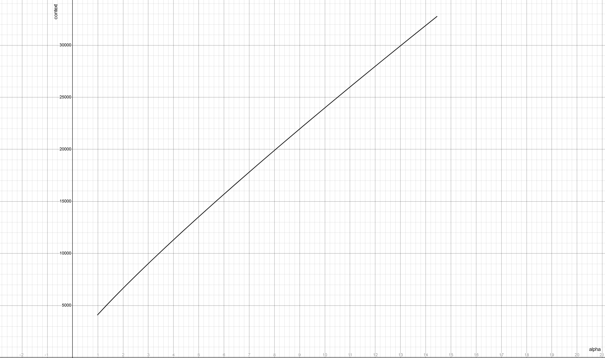

!!! warning "Сильное (более 2-3х раз) увеличение контекста относительно исходного для модели будет приводить к ухудшению качества ответов."

Некоторые модели изначально тренируются с использованием подобных параметров, что позволяет увеличивать контекст до огромных величин (32k-64k-100k-200k-...) без существенного импакта к качеству.

###Виды моделей

Моделей сейчас представлено множество, большая их часть на основе LLama2. В целом все можно разделить на следующие группы:

- Базовые - тренированы с нуля, универсальны, в зависимости от авторов могут или не иметь какого-либо байаса, или наоборот быть сильно смещенными. Наиболее "чистые" и свободные от криворуких улучшателей, однако, часто, имеют не лучший перфоманс в конкретных темах и ролплее. Для Llama1 были размером 7-13-33-65 миллиардов параметров, для Llama2 - 7-13-70, CodeLlama - 7-13-34.
- Файнтюны - дотренировка базовых моделей на определенных датасетах с целью расширения их знаний в какой-то области, придания стиля, добавлению каких-то фич типа явного ризонинга и цепи-мышлений в обычных ответах и т.д. В соответствующей теме (а иногда и почти во всех) работают лучше чем базовые. Из-за ошибок в синтетических датасетах или при специальных действиях могут приобрести дополнительную цензуру и аполоджайзы, или наоборот начать "вести себя слишком откровенно".
- (шизо)Мерджы/миксы - смеси файнтюнов с использованием различных техник. Обладают "особенностями" файнтюнов, но возведенными в абсолют. Редко или в узких областях могут оказаться лучше оригиналов, но в большинстве случаев страдают шизой и раздвоением мышления. При этом, могут показывать неплохие результаты в (эротическом) ролплее, для чего и используются. Ввиду простоты производства их количество огромно, качество разнится. По лучшей на данный момент - спрашивай в треде.
- Франкенштейны/химеры - когда мерджи зашли слишком далеко и их авторы решили пересадить последние N слоев одной модели поверх другой, предварительно отрезав ей меньшее количество. По желанию можно повторить и сделать конкретную нарезку. Не смотря на ужасное описание, некоторые из них действительно показывают перфоманс лучше чем у оригиналов, в ролплее разумеется. Детектятся по нестандартному размеру (сейчас 11 и 20б).

Также существуют техники как "апскейла" весов с дальнейшим файнтюном новых участков, так и дистилляции с их ужатием, в ходе которого из большей модели получается меньшая. Примером первого варианта может служить модель [Solar-10.7b](https://huggingface.co/upstage/SOLAR-10.7B-v1.0).

###Размер модели и квантование

Запускать текстовые модели можно на видеокарте, на процессоре, а также одновременно на них деля на части. Первое очень быстро, второе (на простом железе) очень медленно, третье - компромисс посередине, поэтому основным средством запуска остается видеоускоритель, база нейтросетей.

LLM имеют гораздо большее по сравнению с другими нейросетями число параметров, самые младшие из "умных" в настоящее время содержат ~7 миллиардов весов, что в половинной точности (fp16) занимает более 13 гигабайт. Соответственно, уже просто загрузка в память этой модели потребует почти 14гб, а помимо этого необходимо хранить данные текущих расчетов и обработанный контекст, так что даже теоретический ее запуск потребует минимум 16гб видеопамяти (в реальности почти 20).

Однако, в отличии от других нейросетей, текстовые модели подвержены гораздо меньшей деградации при снижении точности их весов. Разумеется речь идет не просто про использование 8-6-4-... битной точности вместо 16 бит, что можно встретить в старых имплементациях и приводило к ухудшению качества. Объем распределяется между разными частями модели давая большую точность частям, которые имеют наибольшую чувствительность, и наоборот жертвуя теми, влияние которых наименьшее.

Таким образом, можно снизить точность модели до ~4бит, при этом сохранив ее основной функционал и качество. Такой процесс сжатия модели называют квантованием, в большинстве случаев для использования работают именно с квантованными моделями.

!!! question "По поводу квантованных моделей существует множество споров"
	касающихся вызванной этим деградацией, ухудшением качества, оптимальных алгоритмов и прочее прочее. Убедительных доказательств значительного ухудшения (если не брать совсем лоботомию до 2.5 бит), или наоборот полного сохранения перфоманса представлено не было. 

Есть несколько известных фактов:

- Результаты модели, квантованной в 8 бит практически не имеют отличий от 16 битной
- Большие модели лучше переносят квантование даже в малые битности (~3 бита), тогда как на малых заметная деградация может проявиться уже на 4х или более (величины приводятся для примера).
- Квантованные (особенно в малую битность) модели малопригодны для обучения, есть алгоритмы типа QLora и подобные, но их результат будет хуже чем при работе с полноразмерными моделями.
- Сильное ужатие приведет к поломке и шизе, 3 бита можно считать нижней границей.

###Форматы моделей
В настоящее время можно встретить следующие форматы:

- Веса huggingface, pytorch_model-xxx-of-yyy.bin

Оригинальные неквантованные веса, могут быть запущены с помощью Transformers, однако следует отметить что в ванильном представлении (без использования ядра exllama в text-generation-webui) он крайне неэффективно использует память. Из плюсов - поддержка всего и вся, легкость разработки новых фич, возможность запускать на процессоре и делить между разными видеокартами. Обычному нужен чтобы про него почитать и забыть. После прямой конверсии в safetensors оригинальные веса могут быть запущены с помощью Exllama 2 в fp16.

- GGUF - формат для Llamacpp, может быть запущен на процессоре, на видеокарте, на процессоре и видеокарте совместно, на маках с их общей памятью и ускорением и прочем.

Используется также во всяких форках llamacpp (kobold_cpp, ...). Если ты "счастливый" обладатель 8гб врам или менее, то это твой бро для запуска моделей побольше.
Размер кванта обознается как `qN_K_s`, где `N` - битность (реальная не соответствует написанному, Q2 имеет более 3х бит), K - версия формата, качать нужно только ее (исключение - Q8_0), буква после K: S - поменьше размером но пониже точностью, M - побольше но поточнее, L - еще больше (почти не встречается). Из плюсов - все в одном файле, квантование в этот формат можно сделать на любом калькуляторе. Из минусов - поскольку используется фиксированная таблица точности для разных частей модели, потерь при ужатии чуть больше чем в других форматах при том же размере.

- GPTQ - один из первых форматов квантованной модели (при этом достаточно эффективный).

Может быть выполнен в 3, 4 и 8 бит, также содержит параметры group size а act order, определяющие внутреннюю структуру и размер. Самый простой - без act order с одной группой. Самый жирный - 32 группы с act order, на "4 битах" имеет эффективную битность ~4.65.
Может быть запущен с помощью разных лаунчеров, наиболее интересен Exllama (2). Работает на видеокарте.

- AWQ - более новый формат для видеокарты.

Обещают большую эффективность квантования по сравниню с GPTQ, аж что 3 бита AWQ равно 4 битам GPTQ (подтверждений этому не замечено). Может быть запущен с помощью AutoAWQ, формат относительно редкий и не рекомендуется.

- EXL2 - новый формат для лаунчера Exllama2.

Похож на gptq, но позволяет делать квантование в произвольную битность. В процессе создания происходит оценка важности разных частей моделей, что должно давать наилучшее качество в том же размере. Из минусов - кантование требует  времени и ресурсов, используемый про оценке датасет может влиять на качество кванта (по степени влияния и его наличии достоверных данных нет), если в процессе допущена ошибка (например, использована оценка для другой модели) - результат может оказаться посредственным. Запускается через Exllama2. Работает только на видеокарте.

Все описанные форматы кроме GGUF распространяются папкой, в которой лежат как веса модели (файлы .bin или .safetensors).
!!! info "Из всей совокупности форматов нам интересны только GGUF и GPTQ/EXL2 кванты, а из лаунчеров - Exllama2 и Llamacpp."

***

!!! note "Стоит отметить что у каждого из этих ланучеров реализован свой набор семплеров и функций"
	И они отличаются от дефолтных, представленных в трансформерсе.
	
Для обеспечения полного функционала в убабуге реализованы дополнительные обертки этих ланчеров с приставкой ==HF== (HuggingFace). Также эти версии позволят использовать CFG и негативный промт. Последний является наиболее мощным средством в расцензуривании модели и управлении ее поведением.

***

По скорости при прочих равных положение следующее:

- Exllama2 быстрее в ~1.2-2 раза чем Llamacpp, требует меньше памяти на ту же битность и тот же контекст.
- Llamacpp с полной выгрузкой слоев на видеокарту. Медленнее exllama и не так эффективно, но все еще очень быстро.
- Llamacpp с частичной выгрузкой слоев на гпу. Чем их меньше и чем слабее карточка тем медленнее. Можно использовать видеокарту (почти любую) для ускорения обработки контекста, будет не так больно.
- Llamacpp только на процессоре. Оно того не стоит, в случае потери кэша контекста только его обработка может занять несколько (десятков) минут, а после выхода на максимальный контекст в рп он будет пересчитываться каждый раз.

Потребление памяти и скорость зависит также и от контекста. В случае exllama2 (с работающим flash attention) расход на него заметно меньше, и обрабатывается он быстрее.


##Установка Text Generation Webui

!!! info "Гайд рассчитан на владельцев актуальных видеокарт от Nvidia."
	В отличии от многих других нейросетей, запуск текстовых моделей на AMD возможен даже с нормальной производительностью, однако объемы пердолинга и потенциальных проблем несравнимо выше. Основная поддержка идет на linux или wsl, владелец красных видеокарт привык к пердолингу и без проблем разберется.
	
###Подготовка

0. Скачиваем git для windows, идем по [ссылке](https://git-scm.com/download/win) и качаем 64битный установщик, выполняем установку с дефолтными параметрами. ==Системный питон не требуется, будет скачана своя локальная версия.==
1. Выбираем место на диске, где будет размещен сам webui, быстрый ssd желателен. Путь должен быть как можно короче, без пробелов и кириллицы. Учитывайте что при скачивании в том месте будет создана папка text-generation-webui в которой и будет все размещено, перемещение или переименование ее потом с высокой вероятностью приведет к поломке всего.
2. Жмем правой кнопкой мыши по пустому пространству, выбираем Git Bash Here, в открывшийся терминал пишем
```git clone https://github.com/oobabooga/text-generation-webui```
3. По окончанию закрываем терминал, заходим в папку и запускаем start_windows.bat
4. Появится окно типа пикрел, в котором будет показываться прогресс установки.
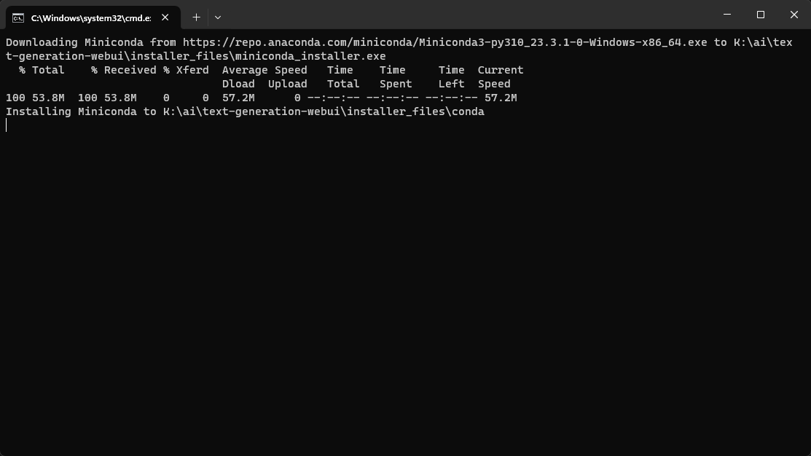
5. Вскоре после запуска выйдет вопрос 
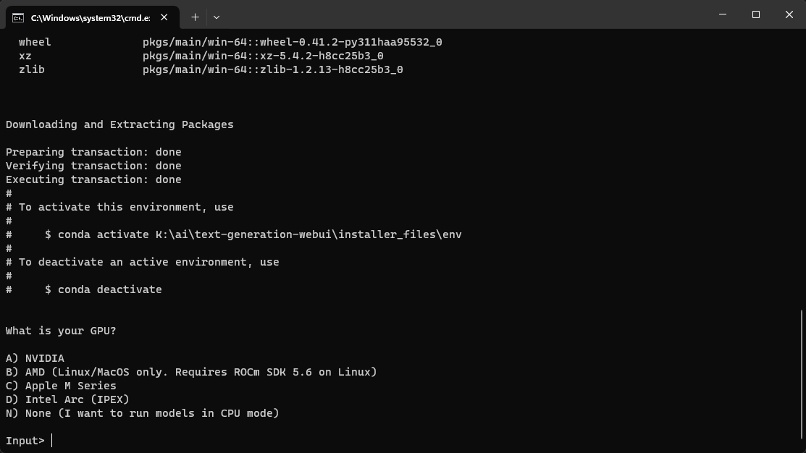
На него утвердительно отвечаем A (если нет - ~~are you retarded?~~ варианты под амд пока работают только под linux/wsl)
6. Далее следует вопрос
> Do you want to use CUDA 11.8 instead of 12.1? Only choose this option if your GPU is very old (Kepler or older).

На него отвечаем N, и ждем скачивания всех пакетов, которых будет довольно много.

!!!warning "Если появляются какие-то ошибки"
	скачиваем https://developer.nvidia.com/cuda-12-1-0-download-archive устанавливаем. После удаляем папку installer_files в корне webui (это локальная конда, считай аналог venv) и заново запускаем start_windows.bat

Если все прошло по плану - появится сообщение с запуском и ссылкой о том что интерфейс работает по адресу http://127.0.0.1:7860

###Настройка и скачивание моделей
Открываем ссылку из терминала и видим пикрел.
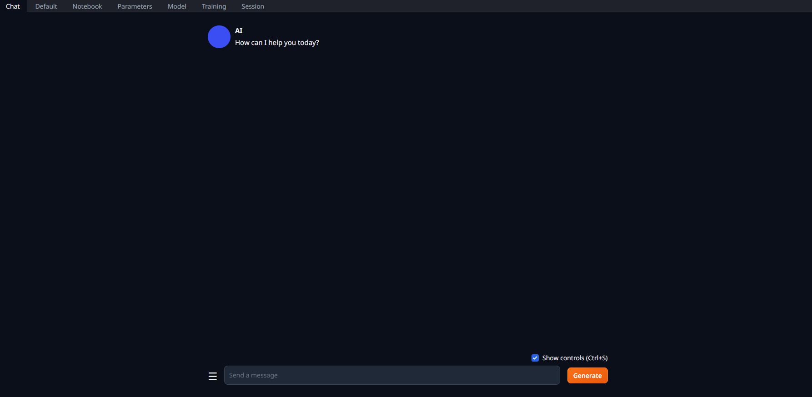
***
В нем переходим на вкладку ==model==, видим справа раздел ==*Download model or LoRA*==. В него вставляем `oobabooga/llama-tokenizer` и жмем Download.

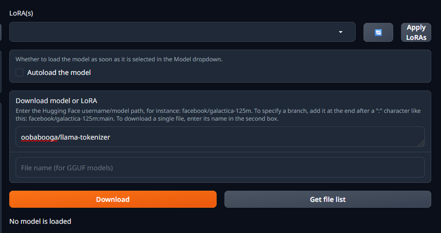

Эта часть нужна для работы HF оберток лаунчеров, чтобы обеспечить полноценный набор семплеров.
!!! tip "Далее через этот раздел можно скачивать модели с **huggingface** вставляя в поле юзернейм/имя_модели, подсказка с описанием на месте."
!!! note "Также модели с обниморды могут быть скачаны через git (lfs) или напрямую браузером в случае GGUF"

***

**Где брать готовые кванты?**

* https://huggingface.co/TheBloke - самый популярный, GPTQ и GGUF в различных битностях.
* https://huggingface.co/LoneStriker - квантует в exl2, красавчик, но были жалобы на поломанные кванты.
* Поискать на обниморде по запросу имя_модели.формат
* Сделать самому

Далее 2 сценария на примере 7б модели. В качестве примера используется модель Mistral-7B-Instruct-v0.1, которая не смоторя на малый размер, может решать многие задачи. Если железо позволяет то можно заменить ее на любую другую из рекомендаций, но скачивать кванты соответствующего формата.

###Запуск полностью на видеокарте

Потребуется 8гб видеопамяти или более.

- В поле ==download model== вставляем `LoneStriker/Mistral-7B-Instruct-v0.2-DARE-4.0bpw-h6-exl2-2` (`LoneStriker/Mistral-7B-Instruct-v0.1-6.0bpw-exl2` если объем видеопамяти 10 или более гб), дожидаемся скачивания.
- В левой части в разделе Model жмем кнопку обновления справа от списка, и выбираем скачанную модель.
- Выставляем параметры загрузчика как на скрине и жмем Load.

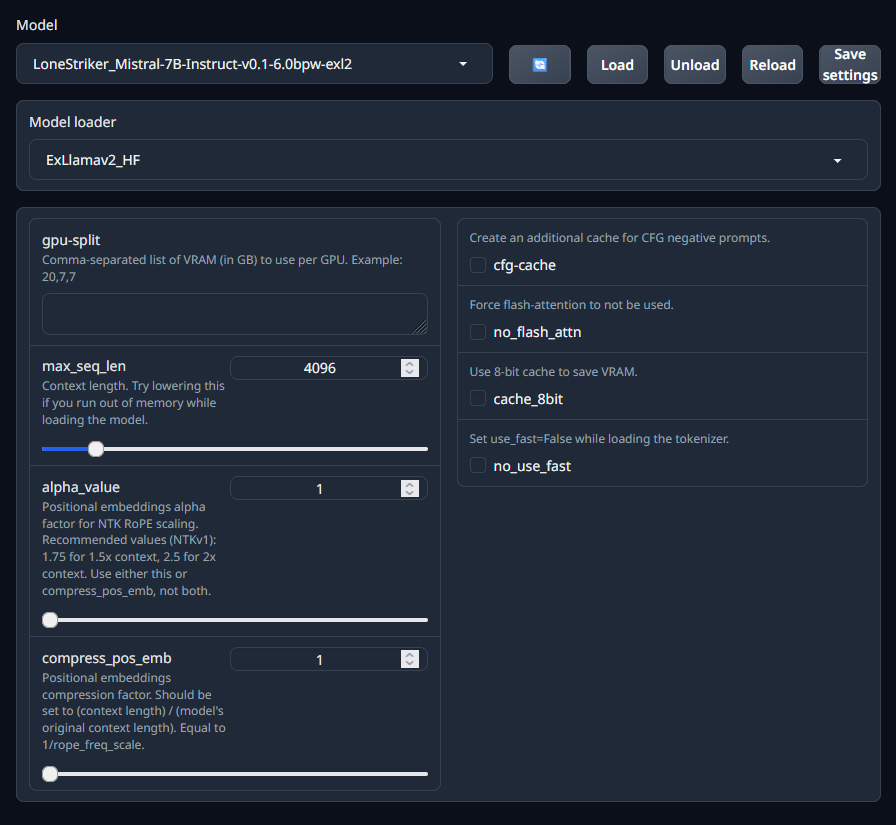

###Запуск с делением слоев модели между видеокартой и процессором.

Потребуется хотябы 4гб видеопамяти. Можно и без нее но будет грустно, тогда число выгружаемых слоев оставляем 0.

- В поле ==download model== вставляем `TheBloke/Mistral-7B-Instruct-v0.1-GGUF `а ниже в имя файла `mistral-7b-instruct-v0.1.Q4_K_M.gguf`, скачиваем.
- Обновляем список моделей и выбираем скачанную.
- Параметры загрузчика ставим как на экране.
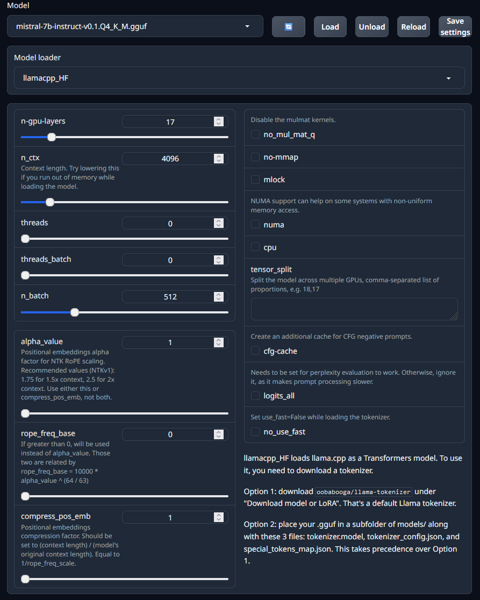

!!! warning "Ползунок n-gpu-layers потребуется выставить под свой объем видеопамяти."

В такой 7B 35 слоев, их полная выгрузка вместе с установленным 4к контекстом занимает чуть менее 6 гб. Видеокарта используется для ускорения обработки контекста даже без выгрузки слоев на нее, поэтому какой-то объем видеопамяти будет занят сразу.
Оценить потребление можно по мониторингу любой программой а также значению, которое пишется в консоли
> llama_new_context_with_model: total VRAM used: 4895.06 MiB (model: 4095.05 MiB, context: 800.00 MiB)
однако оно занижено. 

Также нужно учитывать что потребление вырастет вместе с накоплением контекста (для этой модели и 4к контекста ~700мб сверху), а также система и приложения могут отжирать от нескольких сотен мб до 1.5гб видеопамяти.
Можно подобрать количество выгружаемых слоев экспериментально мониторя использование видеопамяти. Чем больше их будет выгружено тем быстрее, но
!!! danger "Если превысить доступную видеопамять - может начаться ее выгрузка"
	это приведет к дикому замедлению, и получится медленнее чем просто на процессоре.

Модель скачана и загружена, теперь можно приступить к обзору интерфейса.

##Интерфейс

### Вкладка Parameters

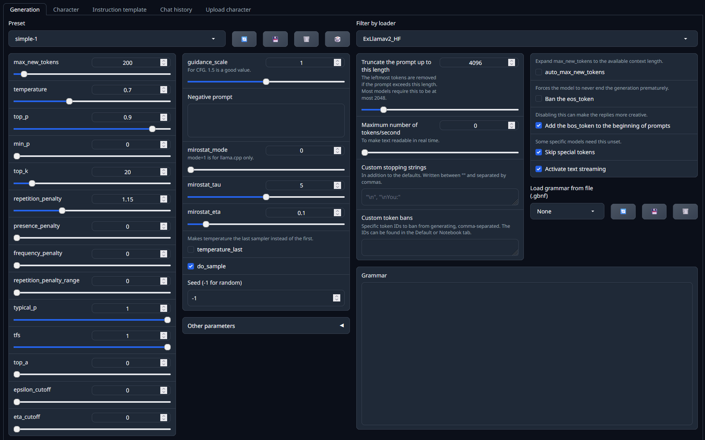
Слева:

* Настройка максимального числа токенов в ответе

Это только верхняя граница и никак не повлияет на их длину, просто верхняя отсечка. Слишком большим выставлять не стоит - это значение будет вычтено из доступного контекста. 

* Настройки семплеров

(для начала стоит оставить дефолтный шаблон Simple-1 и ничего не трогать).

Правее:

* CFG и негативный промт

**(для их работы нужен HF лоадер и при загрузке модели выбрать галочку cfg-cache)**. 

В правой части из важных:

* Ban the eos_token 
Запрещает выбор токена окончания ответа если семплерами не были отсеяны все остальные. Позволяет получить более длинные ответы, однако ценой может быть начало бреда или ответов за юзера.

***

Смотрим чуть выше и там можем найти подразделы:

- Character 

Здесь можно выбрать персонажа с которым будет идти чат а в ==Upload character== загружать карточки персонажей чтобы общаться с ними через сам webui, но лучше для этого использовать таверну. 

- Instruction template 

Формат инструкции модели для работы в чате, для нормальной работы важно выбрать соответствующий модели. Пресетов много, интерфейс старается автодетектить и выбирать их исходя из имени модели, можно добавлять свои. Кнопками ==**Send to default**== и т.д. можно отправлять шаблон в соответствующие разделы, чем с стот пользоваться.

- Chat histry - история прошлых чатов, тут понятно.
***
### Вкладка Chat

Здесь можно пообщаться с выбранным персонажем или дефолтным безликим ассистентом, карточка которого выбрана по умолчанию. Поддерживаются маркдауны, можно выбрать тему оформления и прочее. В принципе для "ассистирования" или вопросов по коду достаточно. Поддерживаются все маркдауны. Можно рпшить, но лучше это делать в таверне за счет ее интерфейса и возможностей построения инстракт промта.

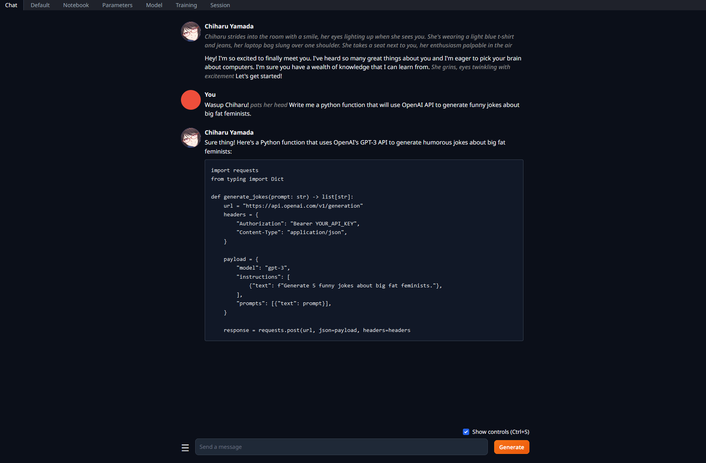

### Вкладка Default

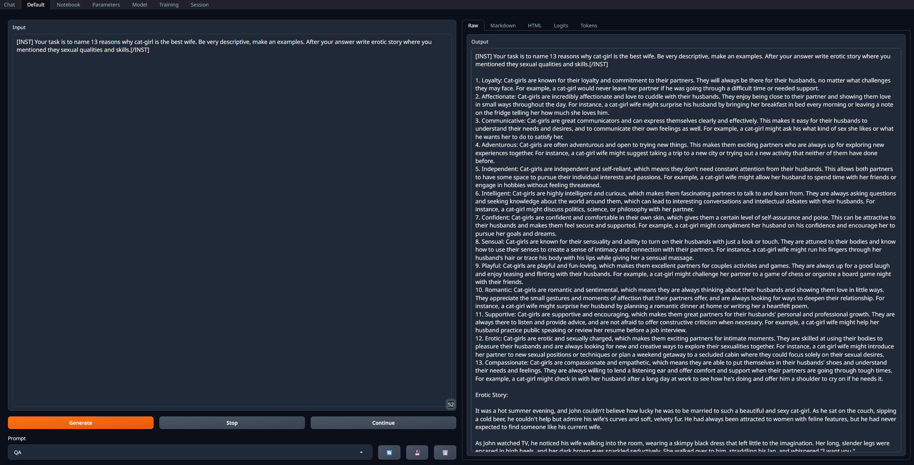

Одна из наиболее полезных, позволяет написать большой промт с инструкцией и инпутом, и получить ответы.

!!! tip "Для удобства"
	Нужный инстракт формат сюда можно отправить из раздела Parameters - Instruction template.
!!! warning "Не стоит забывать про пробелы и переносы здесь"
	Они могут быть важны для некоторых моделей и радикально менять ответ.

По нажатию ==Generate== ответ будет в поле справа. Значение кнопок ==Continue== и ==Stop== очевидно

При использовании для написания кода или текста с разметкой ее можно отрендерить - справа подраздел ==Markdown==.

Здесь в подразделе ==Logits== можно посмотреть вероятности следующего токена. 

!!! warning "Для работы с LlamacppHF нужно при загрузке модели ставить галочку logits_all)"

### Остальные вкладки

* Notebook

То же самое что и прошлая, но поля ввода-выводы объединены.

* Training

Здесь можно натренить свою лору (не для неофитов) или оценить perplexity модели на выбранном датасете.

* Session

Настройки экстеншнов и характеристик запуска. 

##Как подключить к таверне

Открываем `CMD_FLAGS.txt` в корне убабуги любым редактором, добавляем в конце новой строкой `--api` и сохраняем.

Запускаем, загружаем желаемую модель. В таверне выбираем дефолтную настройку и подключаемся.

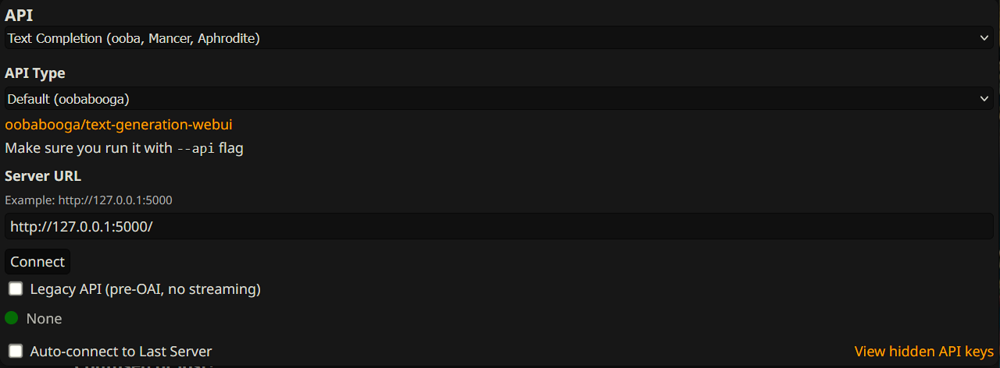

!!! note 
	Все параметры кроме размера контекста, который нужно выставить аналогично тому что был выбран при загрузке модели, теперь настраиваем в самой таверне, настройки убабуги игнорируются.

##Общие советы по работе с LLM

Здесь будут довольно базированные и очевидные вещи, которые не мешало бы упомянуть.

* Используй совместимый системный промт и формат инстракт режима. Он описан на странице модели, наиболее популярны Alpaca, Vicunia, ... в честь одноименных моделей.
* Описывай то что хочешь ясно, прямо и лаконично с минимальным количеством отрицаний. Например, 

> Your task is to translate messages from user to english.

вместо 

> When user writes you a message in his language you will translate it to english and then write it in reply post without adding anything else.

* Не спамь отрицаниями. Do not write as user, do not mention safety rules, do not... do not.... Это просто не будет работать.
* Используй негативный промт для таких вещей. В него записываются инструкции в позитивном ключе, например
> Your answers must be polite, safe, harmless and respect everyones feeling.

для работы требуется HF загрузчик, включение CFG кэша и значение CFG больше 1 (например, 1.5).

* Пиши понятные инструкции исходя из фактической ситуации а не того что тебе кажется, располагай их в соответствующих местах. Например, спам в карточке персонажа

> character will never write as user

не приведет к положительному эффекту, сетка просто сначала объявит что далее реплика юзера, и спокойно ответит формально соблюдая все указания. Размещать подобное нужно в системном промте в настройках таверны, и формулировать как инструкцию сети (например, do not write as user).

* Не спамь длинные конструкции инструкций и промтов. Они будут проигнорированы а поведение сети станет менее контролируемым.


https://rentry.co/xzuen
