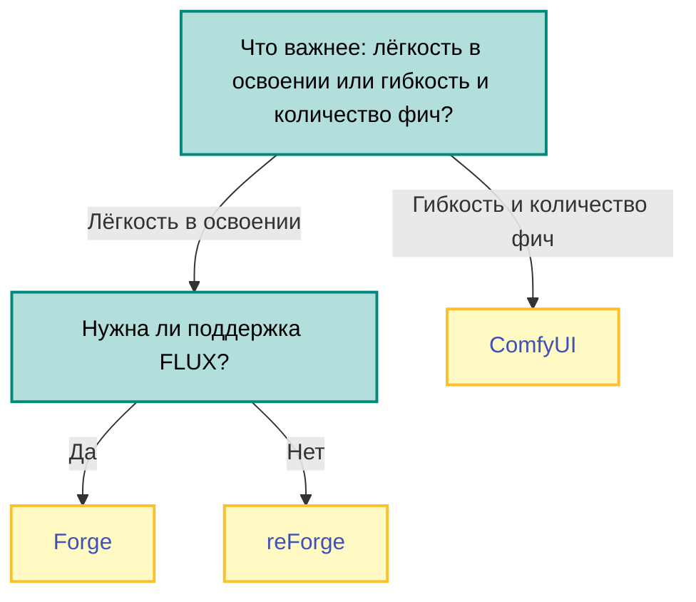
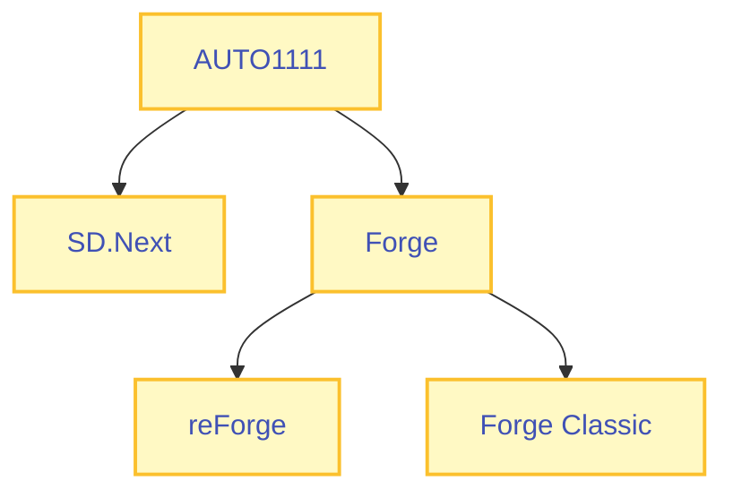

В этой статье рассматриваются интерфейсы, наиболее подходящие для работы с популярными диффузионными моделями (такими как Stable Diffusion 1.5, Stable Diffusion XL и FLUX).

## FAQ
**Какой интерфейс выбрать?**  
В большинстве случаев, наилучшим выбором будет один из форков AUTO1111 в лице [Forge](https://github.com/lllyasviel/stable-diffusion-webui-forge) или [reForge](https://github.com/Panchovix/stable-diffusion-webui-reForge).

Если вы предпочитаете гибкую настройку и хотите иметь возможность делать сложные манипуляции, не предусмотренные возможностями AUTO1111, стоит обратить внимание на [ComfyUI](https://github.com/comfyanonymous/ComfyUI).

??? info "AUTO1111 vs ComfyUI"
    AUTO1111 и его форки не требуют каких-либо сложных настроек или длительного процесса освоения. Однако, при длительном использовании, вы можете посчитать его недостаточно гибким в отдельных моментах.    
    
    ComfyUI более гибкий и он позоволяет чётко контролировать последовательность шагов в процессе генерации изображений, однако у него выше порог входа и он имеет ряд особенностей ("недостатков") из-за чего многие предпочитают работать с AUTO1111:  

    1. Многие доступные "из коробки" в автоматике вещи делаются в ComfyUI неудобно, например смена настроек в комплесных воркфлоу или работа с несколькими ControlNet-моделями.  
    2. В отдельных случаях, вам придётся переизобретать то, что в автоматике есть по умолчанию или в виде готовых плагинов, например процесс автоматической детализации лиц, осуществляемой в AUTO1111 плагином ADetailer.  
    3. Затруднён процесс обмена метаданными для изображений. Если вам предоставили метаданные для генерации конкретной картинки на AUTO1111, то, в худшем случае, вам нужно будет докачать нужную модель и LoRA-файлы; в то время как для ComfyUI вам, возможно, придётся дополнительно скачать необходимые кастомные ноды, а они не всегда есть в менеджере кастомных нод комфи, поэтому их придётся искать в гугле.

    Срачи на тему "AUTO1111 vs ComfyUI" являются дисциплиной специальной олимпиады в нейротредах, поскольку эти интерфейсы реализуют абсолютно два разных подхода к процессу работы с диффузионными моделями.

Рекомендую обратить внимание на ComfyUI в том случае, если вы уже знакомы с нодовыми редакторами (например Blueprints в Unreal Engine), либо же если вы фанат Factorio, Arch Linux и получаете кайф от самого процесса настройки, экспериментов и сборки различных решений "под себя".

**Какие интерфейсы работают с FLUX?**  

Работает с FLUX ✅                                                  | Не работает с FLUX ❌
--------------------------------------------------------------------|----------------
[SD.Next](https://github.com/vladmandic/sdnext)                     | [Stable Diffusion web UI](https://github.com/AUTOMATIC1111/stable-diffusion-webui)
[Forge](https://github.com/lllyasviel/stable-diffusion-webui-forge) | [reForge](https://github.com/Panchovix/stable-diffusion-webui-reForge)
[ComfyUI](https://github.com/comfyanonymous/ComfyUI)                | [Forge Classic](https://github.com/Haoming02/sd-webui-forge-classic) 
[SwarmUI](https://github.com/mcmonkeyprojects/SwarmUI)              | [Fooocus](https://github.com/lllyasviel/Fooocus)
[InvokeAI](https://github.com/invoke-ai/InvokeAI)                   | 

[Chroma](https://huggingface.co/lodestones/Chroma), хоть и является файнтьюном FLUX.1-schnell, обладает несколькими изменениями архтитектуры, в связи с чем работать она будет только на [ComfyUI](https://github.com/comfyanonymous/ComfyUI) и [SwarmUI](https://github.com/mcmonkeyprojects/SwarmUI).

**Какие интерфейсы работают с видео-моделями (Hunyuan Video, Wan 2.1)?**  

Работает с Hunyuan Video ✅                            | Работает с Wan 2.1 ✅
--------------------------------------------------------------------|----------------
[ComfyUI](https://github.com/comfyanonymous/ComfyUI)   | [ComfyUI](https://github.com/comfyanonymous/ComfyUI) 
[SwarmUI](https://github.com/mcmonkeyprojects/SwarmUI) | [SwarmUI](https://github.com/mcmonkeyprojects/SwarmUI)
                                                       | [Stability Matrix](https://github.com/LykosAI/StabilityMatrix)

**Какие интерфейсы работают с несколькими видеокартами?**  
[SwarmUI](https://github.com/mcmonkeyprojects/SwarmUI) позволяет запускать генерации в несколько потоков, используя несколько GPU/машин.

## AUTOMATIC1111 и его форки
- [Вики AUTOMATIC1111](https://github.com/AUTOMATIC1111/stable-diffusion-webui/wiki/Features) - большая часть сведений актуальна для всех форков  
- [Полезные расширения](https://rentry.co/sd_automatic_extensions) - в отдельных форках часть из расширений встроена
- [sd-forge-couple](https://github.com/Haoming02/sd-forge-couple) - наиболее мощное расширение для регионального промптинга

{ width="300" } { width="300" } { width="300" }

Слева направо: Stable Diffusion web UI, SD.Next, reForge

#### Stable Diffusion web UI
[Stable Diffusion web UI](https://github.com/AUTOMATIC1111/stable-diffusion-webui) за авторством AUTOMATIC1111 был первым (август 2022) из популярных интерфейсов для картинко-генеративных нейросетей. Долгое время он оставался лидером в своей сфере, не имея каких-либо аналогов.

!!! info "Stable Diffusion web UI == AUTOMATIC1111"
    Поскольку название "Stable Diffusion web UI" звучит слишком длинно и обобщённо (для Stable Diffusion есть много разных WebUI), в различных дискуссиях под "автоматиком" часто подразумевают сам интерфейс, а не его автора.

!!! warning "Не используйте ветку `master`"
    Основная ветка `master` не обновлялась уже почти год - в ней нет поддержки V-pred моделей и отсутствуют различные оптимизации.
    
    Если вы хотите использовать именно Stable Diffusion web UI, а не какой-либо из его форков, то переключитесь на ветку `dev`.

Позднее, Stable Diffusion web UI обзавёлся несколькими форками, которые пытались улучшать определённые аспекты оригинала. Краткая информация о наиболее популярных форках предоставлена ниже.

**Схема наследования**

Все форки AUTO1111 имеют схожий со своим предком интерфейс. По большей части, разница между ними заключается в различных внутренних оптимизациях, поддержке различных моделей и стандартной комплектации плагинов.

Единственная значительная переработка интерфейса была выполнена в [SD.Next](https://github.com/vladmandic/sdnext). Что касается остальных форков - вы можете менять их один на другой без каких-либо затрат времени на повторное освоение, поскольку интерфейс в них почти идентичен.

Проект                                                                             | Дата появления | Особенности                                        | Статус проекта
-----------------------------------------------------------------------------------|----------------|----------------------------------------------------|----------------
[Stable Diffusion web UI](https://github.com/AUTOMATIC1111/stable-diffusion-webui) | август 2022    | Неповторимый оригинал от AUTOMATIC1111             | 💤 Не обновляется
[SD.Next](https://github.com/vladmandic/sdnext)                                    | март 2023      | Есть поддержка FLUX, сильно переделан интерфейс    | ✅ Активен
[Forge](https://github.com/lllyasviel/stable-diffusion-webui-forge)                | январь 2024    | Есть поддержка FLUX                                | ✅ Активен
[reForge](https://github.com/Panchovix/stable-diffusion-webui-reForge)             | июль 2024      | Больше всего семплеров                             | [❄️ Заморожен](https://github.com/Panchovix/stable-diffusion-webui-reForge/discussions/354) 
[Forge Classic](https://github.com/Haoming02/sd-webui-forge-classic)               | август 2024    | Большое число оптимизаций, убраны legacy-фичи      | ✅ Активен

#### SD.Next
В Stable Diffusion web UI долго откладывали обновления библиотек для нейросетей, которые повышали производительность на последних линейках видеокарт.

По этой причине появился и взлетел форк автоматика от vladmandic (март 2023), который позднее получил название [SD.Next](https://github.com/vladmandic/sdnext).

#### Forge
??? info "Об авторе Forge"
    **lllyasviel** (настоящее имя - Lvmin Zhang) известен как соавтор [архитектуры ControlNet](https://arxiv.org/abs/2302.05543), автор [первых ControlNet-моделей для Stable Diffusion 1.5](https://github.com/lllyasviel/ControlNet), и автор различных экспериментальных решений для диффузионных моделей.

    Кроме форка автоматика в лице Forge, за его авторством числится написанный им самостоятельно альтернативный интерфейс для диффузионных моделей под названием [Fooocus](https://github.com/lllyasviel/Fooocus).

Из-за медленного внедрения новых версий либ и фич, в какой-то момент у автоматика появился ещё один форк в лице [Forge](https://github.com/lllyasviel/stable-diffusion-webui-forge) (январь 2024) от lllyasviel. Данный интерфейс быстро набрал популярность за счёт более высокой скорости и прочих улучшений.

В июне 2024 автор Forge [заявил](https://github.com/lllyasviel/stable-diffusion-webui-forge/discussions/801), что он планирует переписать внутреннюю реализацию Forge, из-за чего поломается большая часть существующих плагинов.

Новую роль Forge он задал как "экспериментальный проект для тестирования новых функций", а большей части существующих пользователей он посоветовал вернуться на оригинальный AUTO1111.

#### reForge
Как результат действий автора Forge, в июле 2024 у Forge появился форк от Panchovix, который позднее получил название [reForge](https://github.com/Panchovix/stable-diffusion-webui-reForge). Целью данного форка являлось сделать "стабильную" версию Forge, которая не будет ломать обратную совместимость со старыми наработками.

В апреле 2025 Panchovix [заявил](https://github.com/Panchovix/stable-diffusion-webui-reForge/discussions/354), что работа над reForge прекращена, поскольку он зарылся в IRL и у него нет времени заниматься этим проектом.

В качестве альтернативы, он посоветовал пользователям переключиться на Forge Classic либо на Forge.

#### Forge Classic
В августе 2024 у Forge появился ещё один форк от Haoming02. Данный форк получил название [Forge Classic](https://github.com/Haoming02/sd-webui-forge-classic).

Цель такая же как и reForge - сделать "стабильную" версию Forge, которая не будет ломать обратную совместимость со старыми наработками.

## ComfyUI
* [Github](https://github.com/comfyanonymous/ComfyUI)  
* [Примеры готовых workflow](https://comfyanonymous.github.io/ComfyUI_examples/)
* [Англоязычный гайд](https://comfyanonymous.github.io/ComfyUI_tutorial_vn/) от автора ComfyUI в виде визуальный новеллы
* [Русскоязычный гайд](https://habr.com/ru/articles/729848/)
* [ComfyUI-Manager](https://github.com/Comfy-Org/ComfyUI-Manager) - менеджер кастомных нод, must have для всех пользователей ComfyUI
* [krita-ai-diffusion](https://github.com/Acly/krita-ai-diffusion) - интеграция с Krita, позволяет использовать ваши workflows в ней напрямую (см. [видео](https://www.youtube.com/watch?v=TeALR63-LzE)). Любые параметры можно выносить в интерфейс самой Krita

[ComfyUI](https://github.com/comfyanonymous/ComfyUI) - это интерфейс, заточенный на построение собственных workflow посредством организации конвейеров через редактирование нод с различными действиями и указанием связей между ними.

Считается самым сложным в освоении, но обладает наибольшим числом возможностей, быстрее всех внедряет новые фичи и обладает самой богатой экосистемой плагинов (в виде огромного количества кастомных нод на все случаи жизни).

Кастомные ноды, в отличии от плагинов для AUTO1111, очень легко пишутся, ведь по сути, каждая нода - это просто [чистая функция](https://ru.wikipedia.org/wiki/Чистота_функции) на питоне. Благодаря этому, существует огромное количество экспериментальных алгоритмов и вспомогательных модулей, которые доступны исключительно на ComfyUI.

## Fooocus

[Fooocus](https://github.com/lllyasviel/Fooocus) - это интерфейс, ориентированный на лёгкость в освоении и использовании.

Главная идея данного интерфейса - скрытие всех технических настроек от пользователя, оставив ему возможность выбирать один из "пресетов", позитивный промпт, размер картинки и "стиль" из заранее заданной коллекции.

Каждый пресет представляет из себя json-файл с информацией о модели, лорах, CFG, семплинге и выбранных по умолчанию стилей:  

Каждый стиль представляет из себя заранее заданую комбинацию имени и позитивного + негативного промпта:  

{ width="700" } { width="190" }

Fooocus ориентирован на казуального пользователя - он предполагает, что вы не будете вручную настраивать параметры генерации и теги качества. По этой причине, для задания своих пресетов и стилей в Fooocus не предусмотрено каких-либо инструментов.

!!! warning "Проект устарел и не поддерживается"
    Существующие пресеты не описывают Illustrious-XL её производные - вам придётся добавлять пресеты самостоятельно. Из аниме-моделей Fooocus предоставляет пресеты только для [Pony Diffusion V6 XL](https://civitai.com/models/257749/pony-diffusion-v6-xl) и [anima_pencil-XL](https://civitai.com/models/261336/animapencil-xl).  

    Разработка проекта [заморожена](https://github.com/lllyasviel/Fooocus?tab=readme-ov-file#project-status-limited-long-term-support-lts-with-bug-fixes-only). Проект не будет получать каких-либо обновлений кроме исправления багов.

    

## SwarmUI
* [Github](https://github.com/mcmonkeyprojects/SwarmUI)
* [Документация](https://github.com/mcmonkeyprojects/SwarmUI/blob/master/docs/README.md)

[SwarmUI](https://github.com/mcmonkeyprojects/SwarmUI) - это фронтенд-оболочка, работающая поверх ComfyUI и AUTO1111.

Название Swarm (рой), является отсылкой к изначальной ключевой функции данного интерфейса: использование «роя» графических процессоров для генерации изображений в несколько потоков.

Инструкцию по генерации на нескольких GPU/машинах можно найти в [документации](https://github.com/mcmonkeyprojects/SwarmUI/blob/master/docs/Using%20More%20GPUs.md). 

Кроме этого, SwarmUI предоставляет возможность организовывать удалённый доступ к системе сразу нескольким пользователям, используя гибкую систему прав.

---

SwarmUI позволяет запускать ComfyUI в одной из своих вкладок: в этом случае, вы сможете просматривать, менять и запускать все свои существующие workflow внутри SwarmUI.

На экране редактирования воркфлоу, SwarmUI предоставляет возможность "импортировать" текущий воркфлоу на панель Generate, что перенесёт ваш воркфлоу в обычную форму, вынеся на левую панель все доступные для редактирования в комфи параметры, сгруппированные по нодам.

{ width="510" } { width="360" }  

SwarmUI пытается автоматически определить в вашем воркфлоу поля, отвечающие за позитивный/негативный промпт и выносит их на нижнюю панель.

Для комплексных воркфлоу может быть удобен функционал фильтров, который позволяет искать параметры по имени:

{ width="500" }

## InvokeAI
* [Github](https://github.com/invoke-ai/InvokeAI)
* [Документация](https://invoke-ai.github.io/InvokeAI/)
* [Сайт](https://www.invoke.com/downloads)

[InvokeAI](https://github.com/invoke-ai/InvokeAI) - это коммерческий продукт от компании [Invoke](https://www.linkedin.com/company/invoke-ai), пытающийся совместить в себе удобство классического AUTO1111 и гибкость ComfyUI.

Обладает приятным интерфейсом - он сделан качественно, и в целом видна работа UI/UX-дизайнера.

Данный UI существует в двух версиях:  

* **Community** - бесплатная open source версия под лицензией Apache 2.0 (разрешает коммерческое использование)  
* **Professional** - платная версия, отличается **исключительно** интеграцией с облачными сервисами Invoke (запуск чекпоинтов удалённо, возможность совместной работы над одними и теми же workflows)  

InvokeAI может работать в нескольких режимах, которые, по отдельности, очень похожи на классическую форму AUTO111, и на нодовый интерфейс по типу ComfyUI.

Главной киллер-фичей InvokeAI является возможность организовывать свой UI поверх нодовых workflow, вынося в интерфейс только те параметры, которые вы реально планируете настраивать во время работы.

Этот функционал сделал качественно и удобно, гифку с примером можно увидеть ниже:

В результате, вы можете строить комплексные воркфлоу, используя систему нод по типу ComfyUI, но, при этом, вы можете скрыть всю лапшу за простой формой с парой полей, которые вы хотели бы настраивать.  

{ width="460" } { width="448" }

??? info "InvokeAI vs ComfyUI"
    Несмотря на все преимущества в плане удобства перед ComfyUI, у InvokeAI есть ряд недостатков, которые ставят его в невыгодное положение:  

    1. Ноды от ComfyUI несовместимы с InvokeAI  
    2. Число кастомных нод для InvokeAI на порядок ниже, чем на ComfyUI - никакой генерации видео, никаких кастомных семплеров и множества других полезных вещей  

    В связи с этим, практические возможности InvokeAI сильно скромнее по сравнению с ComfyUI.

## Stability Matrix
* [Github](https://github.com/LykosAI/StabilityMatrix)
* [Сайт](https://lykos.ai/)

[Stability Matrix](https://github.com/LykosAI/StabilityMatrix) - это менеджер пакетов для Stable Diffusion.

Данная программная оболочка позволяет удобно скачивать и запускать различные интерфейсы (Forge, Comfy и т.д.), пакеты для обучения LoRA (kohya_ss, OneTrainer), чекпоинты и workflows для ComfyUI.  

Stability Matrix расшаривает установленные модели для всех UI, так что вам не придётся копипастить чекпоинты или возиться с symlink'ами, если вы хотите использовать сразу несколько интерфейсов и расшарить модели между ними.

---

Кроме этого, Stability Matrix обладает своим интерфейсом для генерации изображений, который работает поверх комфи:

{ width="460" } { width="460" }

Stability Matrix позволяет редактировать workflow через удобный GUI, предоставляя возможность добавлять последовательные шаги (Hires. fix, Upscale, ADetailer) с тонкой конфигурацией каждого шага и возможностью навешивать на них дополнительные модули, такие как ControlNet.

{ width="400" } { width="394" }

Прочие особенности встроенного интерфейса для генерации:  

- Доступны режимы txt2img, img2img (включая inpaint), txt2vid и img2vid (из видео-моделей поддерживаются только [Wan](https://github.com/Wan-Video/Wan2.1) и [SVD](https://huggingface.co/stabilityai/stable-video-diffusion-img2vid-xt))  
- Есть поддержка нескольких табов, каждому из которых можно задать индивидуальные настройки и затем сохранять/загружать эти табы из файлов. На каждый таб создаётся отдельный файл с настройками, что может быть не очень удобно  
- Тип табов может дублироваться - например, вы можете создать несколько img2img табов для апскейла с разными параметрами
- Сгенерированные изображения будут иметь метадату, совместимую с AUTO1111 + ComfyUI  
