# Up-to-date ComfyUI guide for 1girl and beyond

!!! info "Первоисточник"
    Эта статья представляет собой перевод данного англоязычного руководства редакции от 12 декабря 2025 года:

    <https://rentry.org/comfyui_guide_1girl>

[ComfyUI](https://github.com/comfyanonymous/ComfyUI) — это мощный фронтенд для генерации изображений с крутой кривой обучения. В этом руководстве вы узнаете множество техник для улучшения ваших генераций и тонкой настройки нод. Воркфлоу из скриншотов можно импортировать простым перетаскиванием прямо в ComfyUI (если не получается — попробуйте сначала сохранить изображение на компьютер).

Освоив эти техники, вы научитесь генерировать качественные изображения с одним или несколькими персонажами. Не спешите — изучайте по одной теме за раз, пропуская уже знакомые разделы.

---

Давайте начнём!

<video style="width: 100%;" src="./media/pjoixc.webm" autoplay muted></video>

---

### Предупреждение о кастомных нодах

В этом руководстве используется несколько популярных наборов кастомных нод, хотя по возможности применяются встроенные.

Важно знать, что [кастомные ноды использовались как вектор атаки](https://www.reddit.com/r/comfyui/comments/1dbls5n/psa_if_youve_used_the_comfyui_llmvision_node_from/) в прошлом. Безопасность ComfyUI значительно улучшилась с тех пор, но рекомендуется проявлять осмотрительность и устанавливать только ноды из источников, которым вы доверяете.

Единственный способ обеспечить 100% безопасность — запускать ComfyUI на офлайн-машине или [в контейнеризированной среде вроде Docker](https://github.com/YanWenKun/ComfyUI-Docker). Однако сам Docker может стать объектом эксплойтов нулевого дня. Ни один компьютер с сетевым доступом не будет абсолютно безопасным, поэтому как минимум защитите важные онлайн-аккаунты с помощью многофакторной аутентификации.

---

### Выбор модели

Для аниме-изображений сейчас лучше всего подходят модели на основе Illustrious: отличное качество, хорошее следование промптам на основе тегов и большое количество готовых лор. Если не знаете, какой чекпоинт скачать, берите [WAI 14](https://civitai.com/models/827184?modelVersionId=1761560).

Существует множество достойных альтернативных файнтьюнов и мерджей. Если хотите попробовать что-то другое, посмотрите [Noob](https://civitai.com/models/833294/noobai-xl-nai-xl) или [RouWei](https://civitai.com/models/950531/rouwei). Базовую модель Illustrious также стоит попробовать — у неё более широкий творческий диапазон, чем у мерджей, и она может работать лучше для абстрактных работ без персонажей. (Рекомендуется [Illustrious 1.1](https://civitai.com/models/1252206/illustrious-xl-11))

Для более детальной информации см. [/localmodelsmeta#image-generation-models-anime](https://rentry.org/localmodelsmeta#image-generation-models-anime).

---

### Промптинг

#### Эффективное использование Danbooru

Хороший способ начать — найти изображения, которые вам нравятся, и посмотреть на их теги. Тег `order:score` позволяет отсортировать изображения по рейтингу.

[Вики тегов](https://danbooru.donmai.us/wiki_pages/tag_groups) очень помогает в поиске нужных тегов. Например, чтобы найти тег для конкретной причёски, можно начать с любого связанного тега вроде [long_hair](https://danbooru.donmai.us/wiki_pages/long_hair) — там обычно есть ссылки на группы связанных тегов, например [tag group: hair styles](https://danbooru.donmai.us/wiki_pages/tag_group%3Ahair_styles) со всеми тегами, связанными с волосами.

Также полезен [tag explorer](https://tagexplorer.github.io) для поиска тегов лица, волос, стиля, композиции и художников.

#### Тегируйте всё, что хотите увидеть

SDXL работает не как Midjourney — минимальные промпты не дают детализированных изображений. Нужно заполнить промпт тегами для каждого элемента, который хотите видеть.

Для известных персонажей можно найти нужного персонажа на Danbooru и скопировать теги из хорошо отегированного поста. Описание персонажа может выглядеть так:

`1girl, hatsune miku, hair ornament, twintails, aqua hair, aqua eyes, aqua necktie, grey shirt, collared shirt, detached sleeves, black sleeves, red tattoo, aqua trim, pleated skirt, black shirt, thigh boots, black boots`

Описание фона может выглядеть так:

`bedroom, bed, mirror, school bag, vaulted ceiling, calendar, hanging plant, potted plant, poster \(object\), teddy bear, door, window, blue sky, cumulonimbus cloud`

Экранируйте скобки обратными слешами. `poster (object)` (без экранирования) будет интерпретироваться как `poster object`, потому что скобки используются для весов тегов.

Добавление тегов фона обычно делает персонажа меньше, поэтому допустимо использовать минимальный промпт фона, когда фокус должен быть на персонаже. Минимальные теги фона также полезны, когда нужен абстрактный фон с трудно-тегируемыми элементами. В таких случаях может потребоваться много перегенераций.

Промпт композиции может выглядеть так:

`dutch angle, from behind, perspective, foreshortening, solo focus, pov, hand grab, looking at viewer, looking back, outstretched arm, smiling, excited, blush, happy, pointing forward`

См. также страницу вики [tag group:image composition](https://danbooru.donmai.us/wiki_pages/tag_group%3Aimage_composition).

#### Используйте веса тегов

Веса тегов очень полезны, но новички часто о них забывают. Если тег не работает или работает слишком слабо, просто увеличьте его вес. Синтаксис для этого: `(foreshortening:1.3), (painting_\(object\):0.9)`.

Веса тегов меньше `1` также имеют свои применения, когда тег слишком силён (например, картины появляются по всему изображению, когда нужна только одна).

Это зависит от чекпоинта, но `1.3` обычно максимум, при котором вес тега работает без артефактов. Впрочем, можно попробовать и до `1.5`, главное следить за отсутствием артефактов.

Для пользователей A1111 или Forge, обратите внимание, что [веса тегов ComfyUI работают немного иначе](https://comfyanonymous.github.io/ComfyUI_examples/faq/#why-do-i-get-different-images-from-the-a1111-ui-even-when-i-use-the-same-seed).

#### Можно использовать простые фразы на естественном языке

Это зависит от чекпоинта, но модели Illustrious могут понимать некоторые концепты, которых нет в тегах Danbooru. Например, `blue blade` не является тегом Danbooru, но будет работать. Даже более многословные теги вроде `(tickling feet with cat teaser:1.3)` могут работать. Если тег не срабатывает, попробуйте увеличить его вес.

#### Поиск художественных стилей

Кроме получения тегов из генераций других людей, хороший метод для поиска художников — использовать алгоритмы рекомендаций в соцсетях. Например, Pixiv отлично подходит для этого: алгоритмы начинают рекомендовать похожих художников после подписки на несколько из них. Не все художники будут поддерживаться чекпоинтом или лорами, так что возможно придётся обучить собственные лоры стилей.

Также полезен сайт: <https://tagexplorer.github.io/#/artists>

!!!note "Разные советы"
	- Не меняйте сид во время работы с промптом. Это даёт гораздо лучшее представление о том, как работают теги и их веса. Искать лучшие сиды стоит уже после того, как промпт готов.
	- Автозаполнение тегов внутри ComfyUI доступно через [ComfyUI-Autocomplete-Plus](https://github.com/newtextdoc1111/ComfyUI-Autocomplete-Plus).
	- Теги качества (`masterpiece, best quality` в позитивном промпте, `missing fingers, worst quality` в негативном) — неоднозначная тема. Они сильно зависят от чекпоинта, и не всегда понятно, какие из них лучшие. Лучше всего взять их из качественной генерации на том же чекпоинте или из рекомендаций разработчика модели.

---

### Для начинающих: объяснение базового воркфлоу для text2img

Стандартный воркфлоу для text2img в ComfyUI выглядит примерно так:

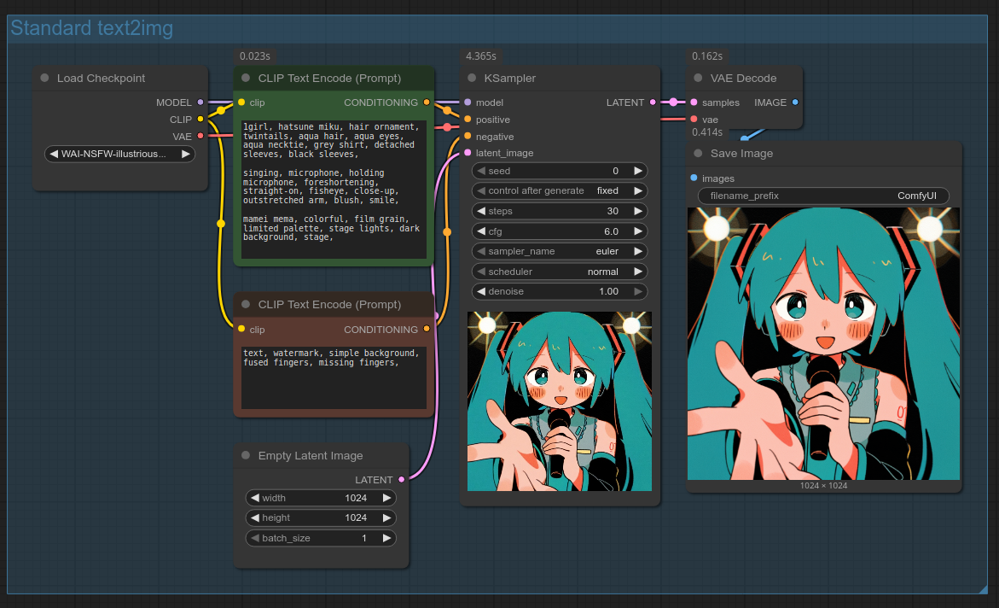

!!! note ""
	*Воркфлоу можно открыть, перетащив скриншот выше в ComfyUI. (Если не работает, сначала нужно сохранить его на ПК.)*

Давайте пройдёмся по каждому элементу, чтобы создать прочную основу для дальнейшей работы. Пропускайте разделы, с которыми уже знакомы.

- Синий фон в воркфлоу — это Группа. Создать её можно двумя способами:
	- Правый клик → "Add Group"
	- Выберите ноды с помощью CTRL+перетаскивание, затем правый клик → "Add Group For Selected Nodes"
- **Load Checkpoint**: Загружает модель на основе SDXL, которая традиционно объединена с моделью CLIP и моделью VAE. Отдаёт три значения:
	- **MODEL**: Чекпоинт, используемый KSampler и другими нодами для шумоподавления (генерации изображений).
	- **CLIP**: Модель, преобразующая текстовые промпты в conditioning — числовые токены, понятные чекпоинту.
	- **VAE**: Модель для преобразования изображений в латентное пространство и обратно. Латентное пространство — это представление изображения, с которым работает KSampler, имеющее в 64 раза меньше пикселей.
- **CLIP Text Encode (Prompt)**: Принимает текстовый промпт и превращает его в conditioning.
- **Empty Latent Image**: Устанавливает разрешение генерации, давая KSampler базовое изображение, заполненное шумом. Можно свободно выбирать количество пикселей и соотношение сторон, но для лучших результатов рекомендуется (а для оригинального SDXL обязательно) придерживаться разрешений с 1 миллионом пикселей, где стороны кратны 8 (1024×1024, 1152×896, 1216×832, 1344×768, 1536×640 и портретные эквиваленты).
- **KSampler**: Нода, выполняющая генерацию. Рассмотрим её настройки:
	- **model**: Очевидно
	- **positive**: Позитивный промпт (элементы, которые должны быть в генерации)
	- **negative**: Негативный промпт (элементы, которых не должно быть в генерации)
	- **latent_image**: Входное изображение. Для text2img — пустое латентное изображение. Для img2img — существующее изображение (преобразованное в латент).
	- **seed**: Число, контролирующее генерацию случайного шума. Теоретически запуск с одинаковым сидом и другими настройками всегда даёт одно и то же изображение. (На практике не совсем так — это отдельная тема.)
	- **control after generate**: fixed/increment/decrement/randomize — как изменяется сид между генерациями. Можно изменить на "**control before generate**" в настройках ComfyUI, в разделе "Widget control mode".
	- **steps**: Количество итераций шумоподавления. Обычно значения находятся в диапазоне от 20 до 35. Оптимум зависит от чекпоинта и промпта. Высокие значения увеличивают время генерации и могут повысить качество, но выше 30 эффект обычно не заметен. При высоких значениях изображения могут стать более насыщенными или пережаренными.  
	- **cfg**: Влияет на то, насколько точно сэмплер следует промпту. Более высокие значения могут быть менее креативными и более пережаренными. Более низкие — слишком ненасыщенными. Оптимум зависит от сэмплера и промпта. 5–6 — хорошее начальное значение.
	- **sampler_name**: Алгоритм, используемый при шумоподавлении. Можно экспериментировать с этой настройкой или придерживаться стандартного Euler, или скопировать настройку из понравившейся генерации, или из рекомендаций разработчика чекпоинта (всегда проверяйте официальную документацию).
	- **scheduler**: "Скорость" (или, точнее, график) удаления шума. Разная скорость шумоподавления на разных этапах может увеличить или уменьшить качество генерации. Применяется тот же совет, что и для sampler_name.
	- **denoise**: Актуально только для img2img. Чем ниже значение, тем ближе результат к исходному изображению.
- **VAE Decode**: Когда KSampler заканчивает работу, результат нужно преобразовать из латентного пространства (в 64 раза меньше реальных изображений) в полноразмерное изображение. Для этого используется модель VAE.
- **Save Image**: Очевидно.

---

### Использование лор

Лоры добавляют стили, концепты и персонажей, которые базовые модели могут не поддерживать (или поддерживать плохо). Найти их можно на [CivitAI](https://civitai.com/). Перед использованием лоры стоит сначала проверить, не поддерживает ли чекпоинт уже нужный концепт. Причины:

- Много плохо обученных лор — концепт, уже встроенный в чекпоинт, может работать лучше.
- Лоры — не "бесплатное" улучшение; они не всегда изящно сочетаются и могут изменять результаты неожиданным образом.
- Есть много лор для Illustrious для концептов, которые Illustrious уже поддерживает. Иногда встроенная поддержка неполная, что оправдывает использование лоры. Но часто лора совершенно не нужна. Причины этого явления:
	- Незнание создателей лор о возможностях модели
	- Портирование лор со старых моделей на Illustrious без проверки поддержки
	- Погоня за популярностью и buzz (валютой CivitAI)

Чтобы использовать лоры, возьмите [стандартный воркфлоу text2img](#для-начинающих-объяснение-базового-воркфлоу-для-text2img) и добавьте ноду "Load LoRA" после "Load Checkpoint" — по одной ноде "Load LoRA" на каждую лору. "Load LoRA" применит лору к значениям "MODEL" и "CLIP" перед подключением их к другим нодам. В этом примере используются [Rozen Maiden Style lora](https://civitai.com/models/1461046/rozen-maiden-style) и [Darkness lora](https://civitai.com/models/902671/sdxl-darkness).

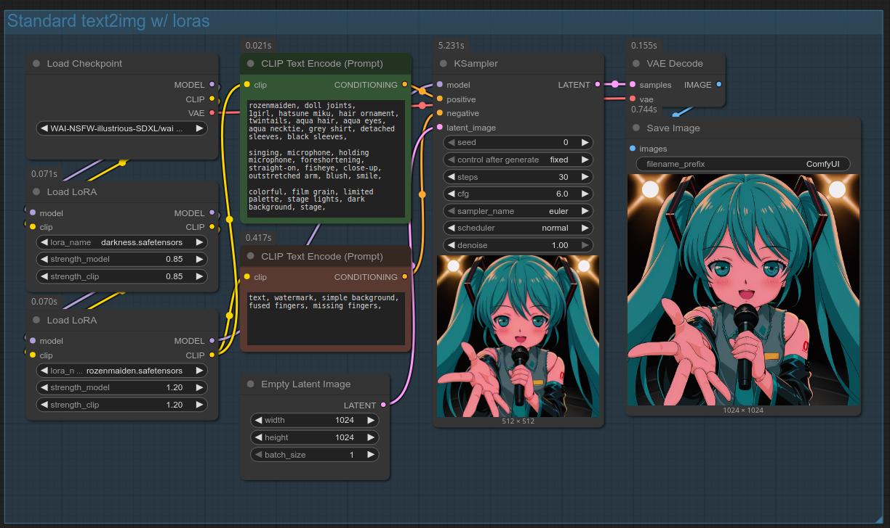

!!! note ""
	*Воркфлоу можно открыть, перетащив скриншот выше в ComfyUI. (Если не работает, сначала нужно сохранить его на ПК.)*

#### Почему это руководство больше не рекомендует LoraLoaderModelOnly

Это руководство ранее рекомендовало использовать "LoraLoaderModelOnly" вместо "Load LoRA". "LoraLoaderModelOnly" проще, потому что применяет лору только к значению "MODEL". Неприменение лоры к CLIP по сути делает триггерные слова лоры ненужными; **однако** это может быть вредным, если лора содержит несколько концептов, а генерировать нужно не все из них (например, мультиперсонажная лора), или при региональном промптинге, когда лору нужно активировать только в определённых регионах. "LoraLoaderModelOnly" всё ещё можно использовать в большинстве случаев, но "Load LoRA" позволит избежать любых подводных камней в будущем.

!!! note "Советы по использованию лор"
	- Всегда проверяйте рекомендуемые теги активации от автора лоры (если они есть)
	- Сила лор может превышать 1 — можно получить отличные результаты со значениями выше 1 на определённых лорах.
	- Одинаковые значения strength_model и strength_clip хорошо работают в большинстве случаев.
	- Для использования одной ноды для нескольких лор и других удобных функций рекомендуется нода "Power Lora Loader" из [rgthree-comfy](https://github.com/rgthree/rgthree-comfy). Она позволяет щёлкнуть правой кнопкой мыши на лоре и выбрать "Show Info", чтобы загрузить и сохранить метаданные CivitAI, такие как теги активации и примеры изображений.
		- [Убедитесь, что вы прочитали это предупреждение о кастомных нодах](#предупреждение-о-кастомных-нодах).
	- Также можно архивировать метаданные лор сразу при загрузке (на случай удаления из CivitAI), используя [это расширение для браузера](https://chromewebstore.google.com/detail/civit-model-downloader/dndabdgaagbfhbfhjkocfafjjabgmhea) или [инструмент CLI civitdl](https://github.com/OwenTruong/civitdl/).

---

### img2img

Img2img очень полезен для нескольких задач:

- Hiresfix (апскейлинг изображений с последующим шумоподавлением)
- Создание вариаций изображений
- Изменение стиля изображения, включая превращение наброска или фото в аниме-иллюстрацию (хотя [ControlNet](#controlnet-передача-позы) для подобного часто подходит лучше)
- Детализация и инпейнтинг также являются частными случаями img2img

Начнём с [базового воркфлоу text2img](#для-начинающих-объяснение-базового-воркфлоу-для-text2img) и отредактируем его для генерации вариаций базовой генерации. Вариации очень полезны, когда есть базовая генерация с удачной композицией, но результат ещё не идеален.

Нужно заменить вход `latent_image` у KSampler: вместо Empty Latent Image использовать ноду "Load Image" и преобразовать изображение в латентное пространство с помощью ноды "VAE Encode". Также следует понизить настройку `denoise` KSampler в диапазон 0.6–0.9, чтобы сохранить некоторые аспекты исходного изображения.

!!!note "Удобства"
	- Ноду можно быстро добавить в любом месте, дважды щёлкнув на пустом пространстве в воркфлоу.
	- Изначальную генерацию можно использовать в качестве входных данных, не сохраняя перед этим на диске: щёлкните правой кнопкой мыши на ней и выберите "Copy", затем щёлкните на ноде "Load Image" и нажмите CTRL-V.
		- Более удобный способ — использовать ноду "Load Image (from Outputs)". Она автоматически (или по щелчку кнопки) загружает последний результат. Если не можете найти эту ноду, обновите ComfyUI.

При использовании img2img убедитесь, что текстовый промпт всё ещё описывает то, что нужно сгенерировать.

Вот как теперь должен выглядеть ваш воркфлоу:

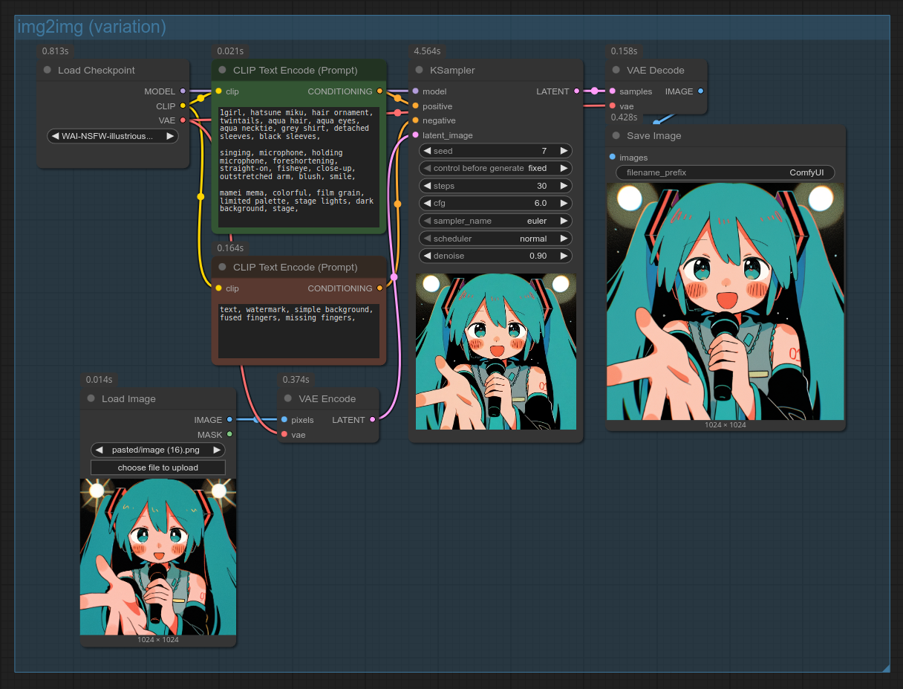

!!! note ""
	*Воркфлоу можно открыть, перетащив скриншот выше в ComfyUI. (Если не работает, сначала нужно сохранить его на ПК.)*

А вот точно такой же воркфлоу, за исключением того, что тег художника был изменён с `mamei mema` на `ilya kuvshinov`:

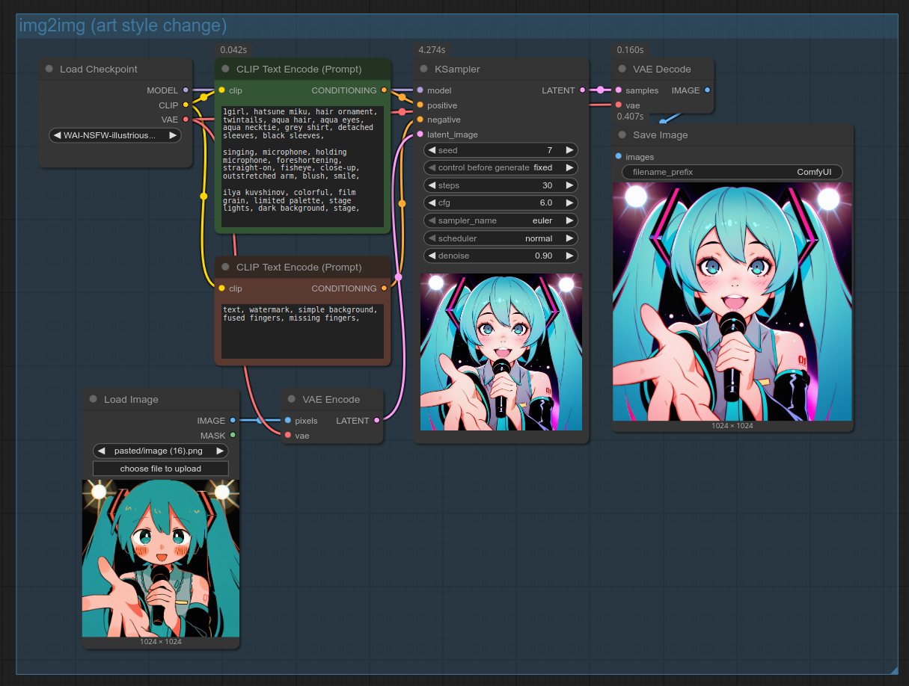

---

### Hiresfix

"Hiresfix" — это жаргонное слово, которым называют апскейлинг изображения, а затем ресэмплинг с умеренным уровнем шумоподавления (обычно в диапазоне 0.25~0.6) для добавления деталей и улучшения рисовки.

Есть несколько способов сделать это. Один из подходов: генерация базового изображения в стандартных разрешениях SDXL с 1 миллионом пикселей, апскейлинг, а затем запуск img2img с тем же промптом и denoise в диапазоне 0.25~0.6.

Можно генерировать сразу в целевом разрешении, но у этого есть недостатки. Чем выше разрешение, тем дольше генерация — это замедляет подбор промптов и поиск хороших сидов. Кроме того, при высоких разрешениях чаще появляются артефакты: дублирование объектов и визуальные глитчи. Запуск img2img с использованием базового изображения частично решает проблему с артефактами.

Степень апскейлинга зависит от промпта — некоторые стили более устойчивы к апскейлингу, чем другие. Я обычно использую коэффициент 1.2–2.

Для hiresfix нужно взять [воркфлоу img2img](#img2img) из предыдущего раздела и внести небольшие изменения: перед преобразованием входного изображения в латентное пространство с помощью ноды "VAE Encode" нужно апскейлить изображение с помощью ноды "Upscale Image By". Результат должен выглядеть так:

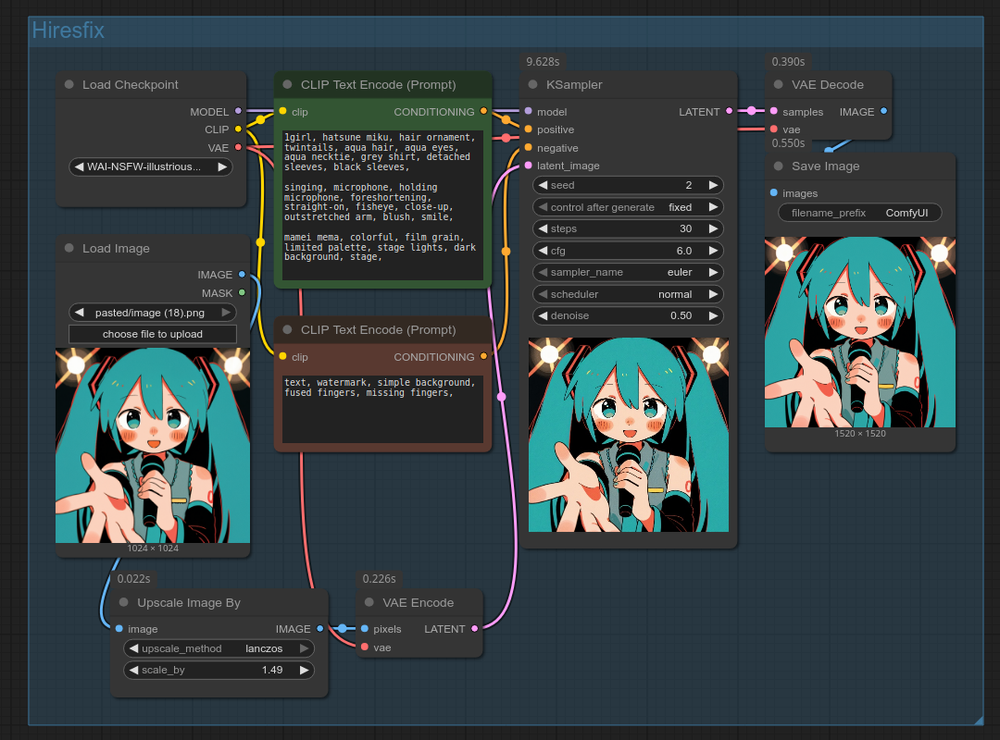

!!! note ""
	*Воркфлоу можно открыть, перетащив скриншот выше в ComfyUI. (Если не работает, сначала нужно сохранить его на ПК.)*

В редких случаях базовые генерации имеют удачные черты лица или композицию, которые теряются во время ресэмплинга — тогда можно не использовать hiresfix вообще. Но апскейлинг всё ещё возможен без ресэмплинга, и в этом случае лучше использовать модель AI-апскейлинга. Модель AI-апскейлинга также можно использовать для hiresfix, хотя улучшения минимальны при denoise выше ~0.25. Поскольку AI-модели апскейлят с фиксированным коэффициентом, который часто >=2, придётся затем даунскейлить изображение обратно до целевого разрешения перед ресэмплингом. Пример можно посмотреть, перетащив [это изображение](./media/ai_model_upscale.png) в ComfyUI.

---

### Детализация лица и рук

ИИ испытывает трудности с мелкими деталями: чем меньше элемент, тем более испорченным он будет выглядеть. Чтобы исправить это, нужно обработать элемент как отдельную генерацию крупным планом, выполняя img2img на обрезанной (и заапскейленной) версии элемента. Это иногда называется ADetailer (after-detailer) по названию старого расширения A1111. Начнём с лиц и рук, потому что существуют действительно хорошие модели распознавания для них, что избавляет от необходимости вручную маскировать эти области.

Некоторые делают детализацию перед шагом апскейлинга/hiresfix. Это означает, что hiresfix должен иметь очень низкий denoise, чтобы сохранить добавленные детали, поэтому рекомендуется делать детализацию после hiresfix.

Возьмите эту генерацию в качестве примера (откройте её в ComfyUI для воркфлоу):

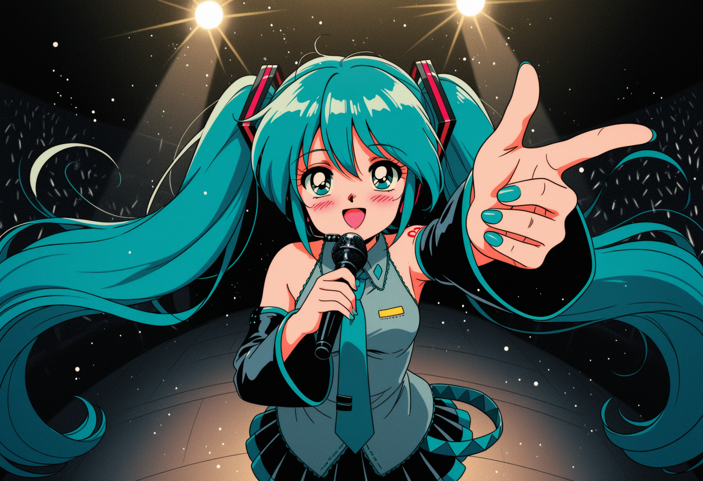

Hiresfix уже очень помог, но правая рука определённо могла бы выглядеть лучше. Настроим воркфлоу, чтобы исправить это.

Сначала установите наборы кастомных нод [ComfyUI-Impact-Pack](https://github.com/ltdrdata/ComfyUI-Impact-Pack) и [ComfyUI-Impact-Subpack](https://github.com/ltdrdata/ComfyUI-Impact-Subpack). Если вы ещё не установили [ComfyUI-Manager](https://github.com/Comfy-Org/ComfyUI-Manager), рекомендуется также установить его для более удобного управления кастомными нодами.

!!! danger "Важно"
	[Убедитесь, что вы прочитали это предупреждение о кастомных нодах](#предупреждение-о-кастомных-нодах). В настоящее время не существует вменяемого и эффективного способа выполнять детализацию и инпейнтинг без использования кастомных нод. Если уж на то пошло, создатель наборов нод Impact является членом [Comfy-Org](https://github.com/Comfy-Org). Однако это не гарантирует безопасность.

После установки нод Impact настройте их, как показано ниже. Не обязательно копировать точные настройки; настройки по умолчанию вполне подходят для начала. Impact автоматически загружает модели bbox и SAM при установке.

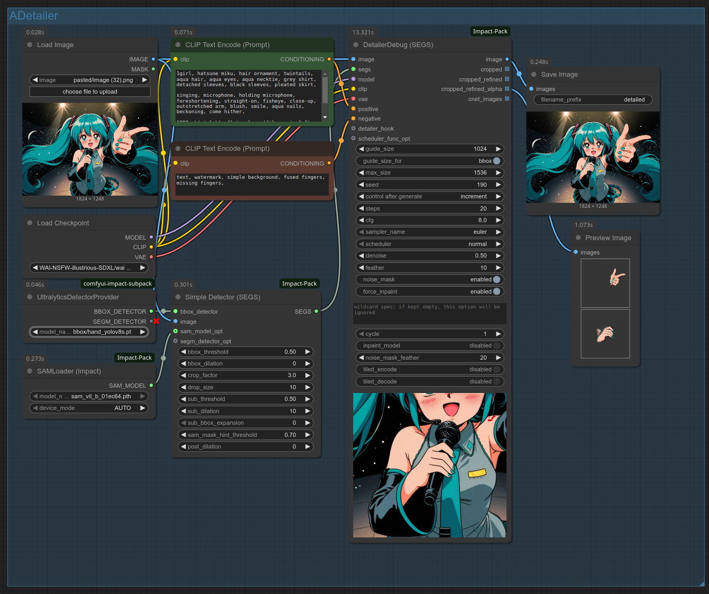

!!! note ""
	*Воркфлоу можно открыть, перетащив скриншот выше в ComfyUI. (Если не работает, сначала нужно сохранить его на ПК.)*

Запуская воркфлоу, получаем это до/после:

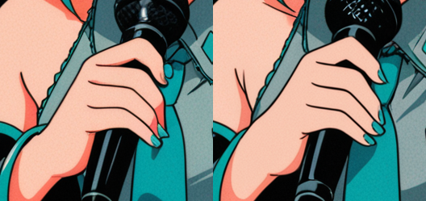

Отличный результат! Несмотря на обилие параметров, большинство из них можно не трогать — значения по умолчанию хорошо работают. Вот ключевые настройки для улучшения результата:

- DetailerDebug (SEGS)
	- denoise:
		- Ниже = меньше изменений, выше = больше изменений
		- Стандартный 0.5 — отличная отправная точка, типичные значения в диапазоне 0.4~0.6
	- noise_mask_feather:
		- Длина (в пикселях) мягкого затухания на краях инпейнченной области. Создаёт градиент прозрачности маски, который влияет на интенсивность шумоподавления: чем прозрачнее пиксель, тем ниже его denoise. Это обеспечивает плавное смешивание краёв.
		- При детализации маленьких областей рекомендуется снизить значение: иначе градиент займёт слишком большую долю области, и эффект детализации будет слабым.
	- noise_mask:
		- Всегда оставляйте включённым. При включении сэмплер обрабатывает только маскированную область и на каждом шаге смешивает её с немаскированными областями. Отключение приведёт к видимым швам.
- Simple Detector (SEGS)
	- crop_factor:
		- Вот как это работает, используя примерные значения:
			- 1 = холст обрезается только до руки
			- 3 = холст обрезается до размеров руки * 3
			- Низкое значение — плотная обрезка только нужной области. Добавляется больше мелких деталей, но меньше контекста для согласования с остальным изображением (поза, освещение могут не совпасть).
			- Высокое значение — широкая обрезка с окружением. Добавляется меньше деталей, но больше контекста, что помогает результату органично вписаться в изображение.

(SEGS — это просто странное название, которое автор Impact даёт данным маски для обозначения области детализации.)

Чтобы детализировать лицо, просто измените у ноды UltralyticsDetectorProvider выбранную модель на `face_yolov8s.pt`, которая также автоматически загружается Impact.

При детализации лица и рук часто можно повторно использовать промпт базового изображения и получать отличные результаты. Но если crop_factor уменьшен или denoise увеличен, может потребоваться скорректировать промпт, чтобы описать только обрезанную область. В противном случае получится 1girl внутри 1girl!

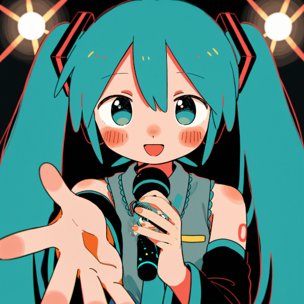

Стоит знать, что есть много альтернативных детейлеров на Huggingface и CivitAI. В некоторых случаях они могут быть полезны.

!!! danger "Важно"
	Модели детекторов используют формат .pt (pickletensor), который менее безопасен, чем .safetensors. Устанавливайте pickletensors только из источников, которым доверяете. Как и с кастомными нодами, требуется собственная должная осмотрительность. Если не хотите запускать pickletensors, лица и руки можно маскировать вручную — это несложно и работает хорошо. См. раздел [Инпейнтинг](#инпейнтинг) для более подробной информации.

---

### Инпейнтинг

Инпейнтинг — это запуск img2img только на части изображения. [Детализация лица и рук](#детализация-лица-и-рук) является формой инпейнтинга с автоматическими детекторами. В этом разделе рассмотрим инпейнтинг с ручным выбором области обработки.

Задачи инпейнтинга включают как улучшение деталей на размытых областях (детализацию), так и более серьёзные изменения: добавление новых элементов, удаление объектов или изменение их цвета и формы. Есть две основные сложности, с которыми сталкиваются новички:

- Для детализации маленьких областей их нужно обрезать и заапскейлить, создав эффект крупного плана. Ноды детейлера Impact автоматизируют этот процесс.
	- Хотя это руководство не использует этот метод, для такой цели отлично подходит набор нод [ComfyUI-Inpaint-CropAndStitch](https://github.com/lquesada/ComfyUI-Inpaint-CropAndStitch).
- Инпейнтинг обычно создаёт видимые швы. Чем выше denoise, тем заметнее швы. При серьёзных изменениях (не просто детализации размытых областей) требуется высокий denoise, и проблема швов усугубляется. Основные методы борьбы со швами (если что-то непонятно — не переживайте, разберём дальше):
	- **Размытие маски (Mask feathering)** — плавный переход от обработанной области к исходной через градиент прозрачности ("мягкий" край маски)
	- **Дифференциальная диффузия (Differential diffusion)** — применение силы denoise пропорционально непрозрачности маски на её краях
	- **Маска латентного шума (Latent noise masking)** — ресэмплинг только маскированной области (настройка `noise_mask` в ноде Detailer, аналог ноды "Set Latent Noise Mask")
	- **Грубый эскиз** — рисование поверх базового изображения для снижения требуемого denoise (навыки рисования не нужны, достаточно уровня детского рисунка)
	- **Двойной проход** — сначала высокий denoise, затем повторный проход с низким denoise
	- **Inpaint ControlNet**
	- **Специализированные модели инпейнтинга**

В этом руководстве не используются inpaint ControlNet и специализированные модели инпейнтинга, но полезно знать об их существовании.

#### Детализация произвольных областей

Для инпейнтинга используются те же ноды детейлера Impact из что мы использовали в [Детализации лица и рук](#детализация-лица-и-рук), но вместо автоматического обнаружения лиц и рук область выбирается вручную. Ноды Impact включают не только встроенную обрезку, [но и дифференциальную диффузию](https://github.com/ltdrdata/ComfyUI-Impact-Pack/issues/497#issuecomment-1978118189)! Это делает их идеальными для инпейнтинга.

В качестве примера возьмём эту базовую генерацию и попробуем улучшить птицу. (Генерацию можно перетащить в ComfyUI для импорта воркфлоу.)

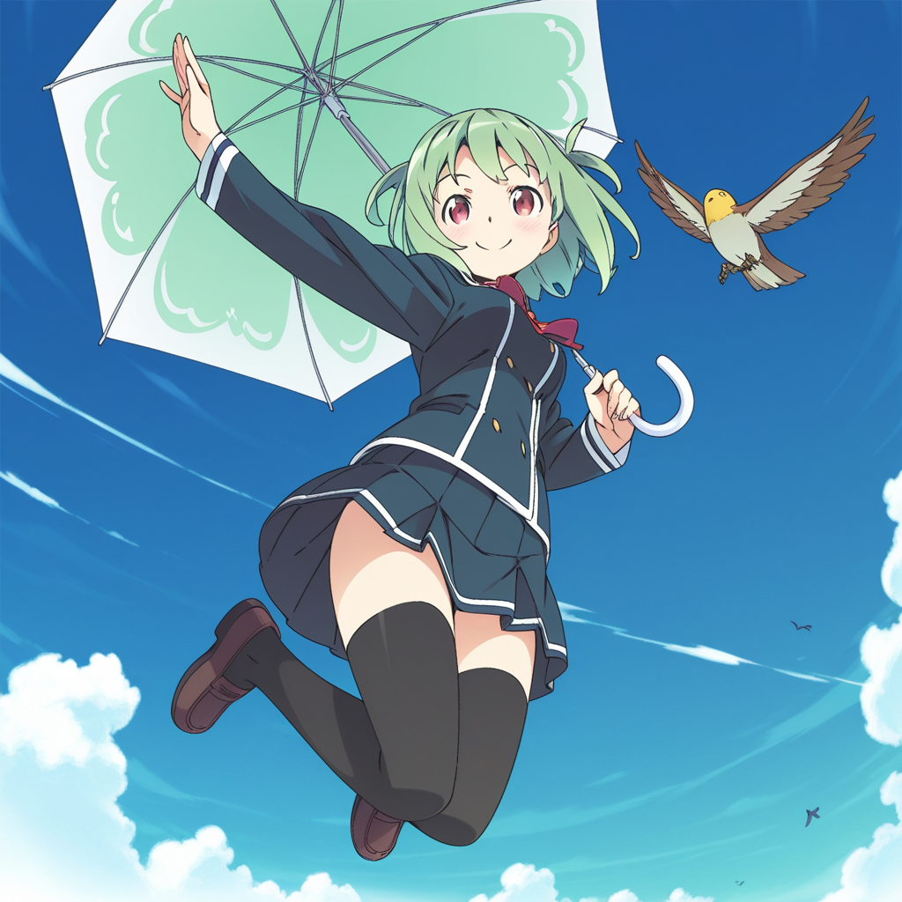

Полный промпт: `1girl, kanzaki hiro, green hair, smile, school uniform, holding umbrella, from below, blue sky, jumping, black thighhighs, bird, bird on hand,`.

Нужно взять [воркфлоу ADetailer из предыдущего раздела](#детализация-лица-и-рук) и изменить вход "segs" ноды "DetailerDebug (SEGS)", чтобы она получала вручную выбранную область вместо автоматически обнаруженной:

- Сначала удалить ноды "UltralyticsDetectorProvider", "SAMLoader (Impact)" и "Simple Detector (SEGS)" — автоматические детекторы здесь не используются.
- Затем добавить ноду "MASK to SEGS" и подключить к ней выход "MASK" ноды "Load Image". После этого подключить выход "SEGS" ноды "MASK to SEGS" к входу "segs" ноды "DetailerDebug (SEGS)".
- Наконец, щёлкнуть правой кнопкой мыши на загруженном изображении в ноде "Load Image", выбрать "Open in MaskEditor" и закрасить чёрным цветом область, которую нужно инпейнтить. В данном случае — птицу.

Интерфейс MaskEditor выглядит так:

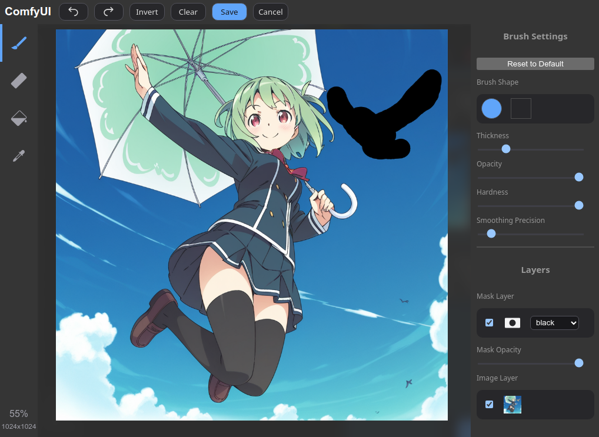

Воркфлоу после изменений:

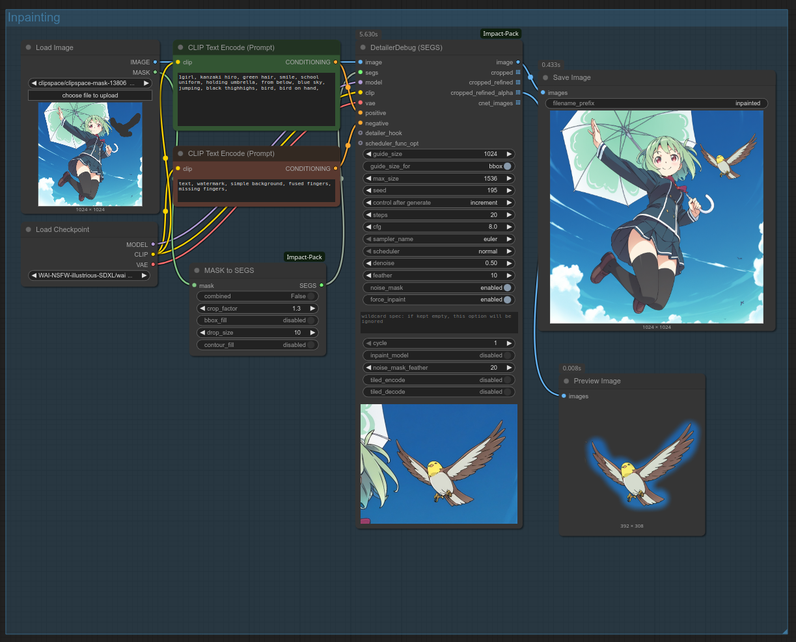

Как и ранее, скриншот можно перетащить в ComfyUI для получения воркфлоу; однако базовое изображение и маску птицы в MaskEditor потребуется создать самостоятельно, поскольку ComfyUI не экспортирует данные загруженных изображений.

Результат до/после:

В этом примере crop_factor был снижен до 1.3 для плотной обрезки птицы, а denoise оставлен по умолчанию 0.5. Это хорошие настройки для добавления деталей в небольшую область.

#### Внесение больших изменений в область

Предположим, нужно сгенерировать совершенно другую птицу. Что произойдёт при увеличении denoise до 0.7? Результат:

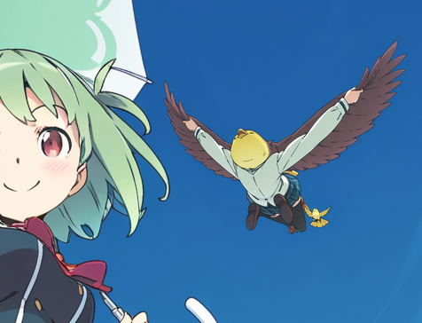

Упс. С более высоким denoise KSampler добавил птице школьную форму. Чтобы исправить это, нужно изменить промпт так, чтобы он описывал только обрабатываемую область. Изменение промпта на `kanzaki hiro, bird, blue sky` даёт такой результат:

Намного лучше!

#### Изменение цветов

Рассмотрим пример, требующий более продвинутых методов. Задача: изменить цвет волос 1girl на красный. Сделать это сложно уже известными техниками, потому что img2img плохо справляется с изменением цветов. Результат с промптом `1girl, kanzaki hiro, red hair, holding umbrella, blue sky` и denoise 0.7:

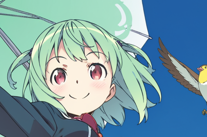

Неэффективно. Приходится повышать denoise и crop_factor. Результат с denoise 0.85 и crop_factor 4:

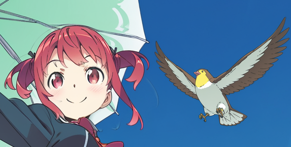

Лучше!... Но всё ещё странновато. Видны швы, а волосы выглядят слишком тонкими — высокий denoise слишком сильно изменил композицию. В некоторых случаях стоит поэкспериментировать с настройками размытия маски или сделать второй проход инпейнтинга с более низким denoise для детализации. Но здесь проще набросать эскиз поверх исходного изображения в ComfyUI или редакторе изображений (например, MS Paint), затем импортировать эскиз в ноду "Load Image" и перерисовать маску.

!!! info "Эскизы в MaskEditor"
	Последняя версия ComfyUI поддерживает создание эскизов внутри MaskEditor.

Чем детальнее эскиз, тем ниже требуемый denoise и тем предсказуемее результат. Однако в большинстве случаев простой набросок с умеренно высоким denoise работает вполне нормально. Пример с denoise 0.75 и crop_factor 2:

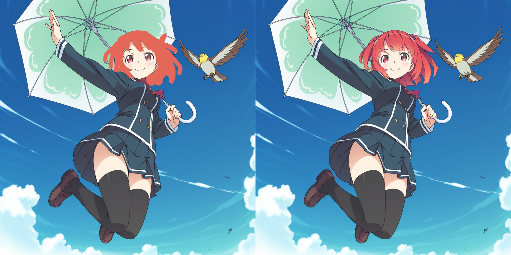

Выглядит гораздо лучше!

#### Заключение

Это всё, что вам нужно знать об инпейнтинге внутри ComfyUI. Стоит также упомянуть [krita-ai-diffusion](https://github.com/Acly/krita-ai-diffusion) — альтернативный UI для инпейнтинга в ComfyUI. Он предлагает более удобный интерфейс, но с меньшим контролем. Особенно полезен при наличии графического планшета и навыков рисования (хотя они не обязательны).

---

### ControlNet (передача позы)

ControlNet — техника для переноса композиции/позы изображения в генерацию. Полезна для задания композиций, которые модели SDXL не могут сгенерировать просто через промпт — как для одиночных персонажей, так и для нескольких (особенно в сочетании с [региональным промптингом](#2girls-и-региональный-промптинг)).

Для работы с ControlNet нужно взять [стандартный воркфлоу text2img](#для-начинающих-объяснение-базового-воркфлоу-для-text2img) и дополнить его встроенной нодой "Apply ControlNet". Рассмотрим её входы и выходы.

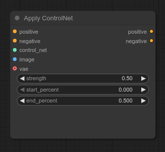

Нода принимает значения conditioning `positive` и `negative`, и отдаёт новые значения conditioning `positive` и `negative` с применённым ControlNet. ControlNet можно отключить, выбрав ноду "Apply ControlNet" и нажав CTRL-B: если нода отключена, она отдаст значения `positive` и `negative` без изменений.

Нода "Apply ControlNet" также принимает вход `control_net`, который нужно передать через "Load ControlNet Model". Рекомендуется использовать [diffusion_pytorch_model_promax.safetensors из xinsir/controlnet-union-sdxl-1.0](https://huggingface.co/xinsir/controlnet-union-sdxl-1.0/tree/main) который отлично работает с моделями SDXL. Он способен обрабатывать большинство типов ControlNet и автоматически определять тип входного изображения, поэтому не требуется переключаться между разными моделями ControlNet или настраивать ноду "SetUnionControlNetType".

Нода "Apply ControlNet" также имеет вход `image`, который должен быть **референсным изображением ControlNet**. Простейший способ сгенерировать референсное изображение ControlNet — соединить ноду "Load Image" с кастомной нодой "AIO Aux Preprocessor" из [comfyui_controlnet_aux](https://github.com/Fannovel16/comfyui_controlnet_aux). Выход `IMAGE` "AIO Aux Preprocessor" можно также подключить к ноде "Preview Image" для проверки результата.

!!! danger "Важно"
	[Убедитесь, что вы прочитали это предупреждение о кастомных нодах](#предупреждение-о-кастомных-нодах). Если уж на то пошло, [официальная документация ComfyUI предлагает comfy_controlnet_aux](https://docs.comfy.org/tutorials/controlnet/controlnet). Однако это не гарантирует безопасность.

"Apply ControlNet" также требует модель VAE, поэтому подключите VAE от ноды "Load Checkpoint" к ней.

Перед рассмотрением настроек проверим получившийся воркфлоу:

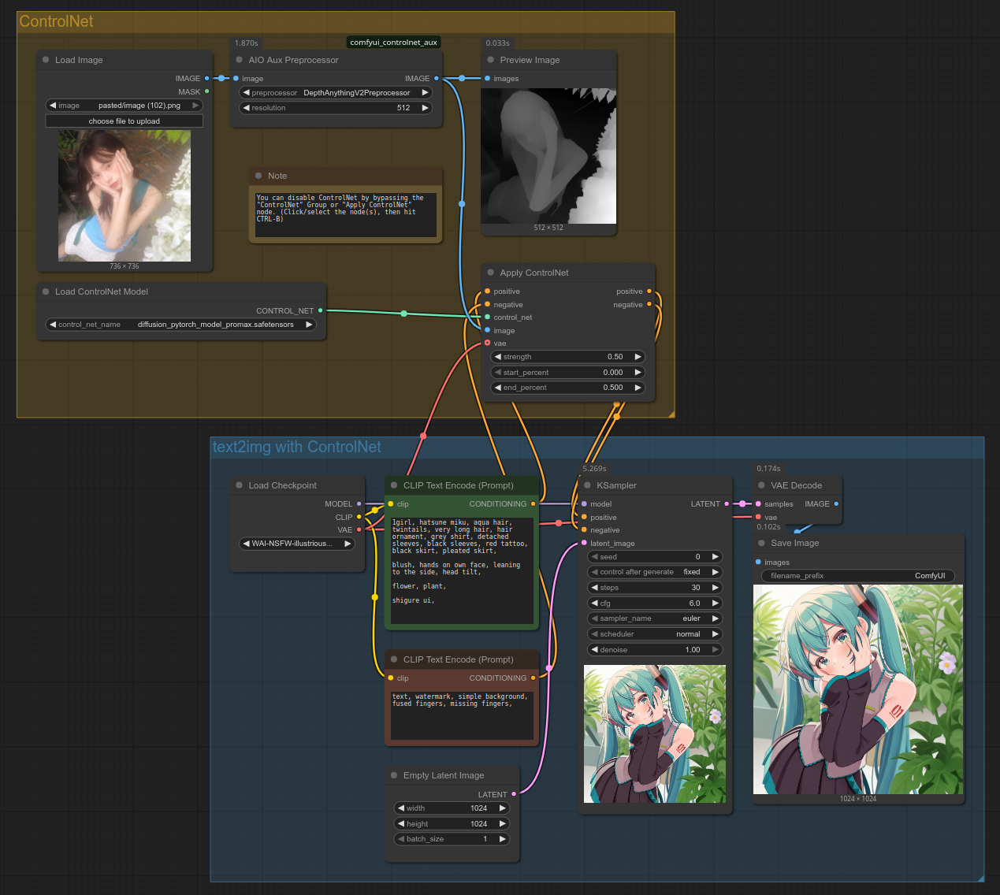

!!! note ""
	*Воркфлоу можно открыть, перетащив скриншот выше в ComfyUI. (Если не работает, сначала нужно сохранить его на ПК.)*

А вот референсное изображение для ControlNet и результат:

Референсное изображение | Результат
----- | -----
 | 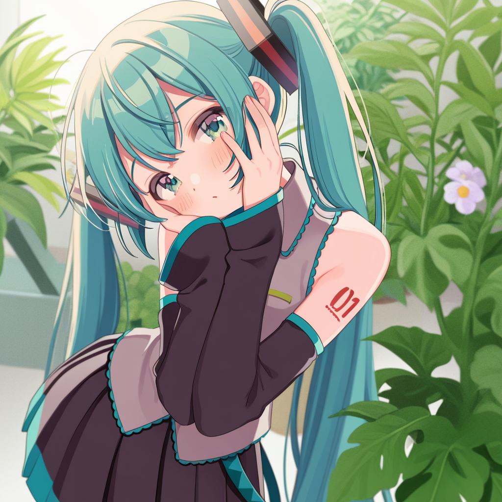

Рассмотрим настройку `preprocessor` в "AIO Aux Preprocessor". Можно попробовать другие варианты, но рекомендуются следующие:

- **DepthAnythingV2Preprocessor**: передаёт позу/композицию, используя карту глубины.
- **PyraCannyPreprocessor**: передаёт позу/композицию, используя контуры.
- **OpenposePreprocessor**: передаёт позу, используя скелет позы. Работает надёжно только с изображениями живых людей.

Другие важные настройки — `strength` и `end_percent` в "Apply ControlNet". 0.5 — хорошее начальное значение для обоих. Более низкая `strength` позволяет каждому шагу шумоподавления больше отклоняться от исходного изображения. Более низкий `end_percent` удаляет ControlNet на более ранних шагах шумоподавления. Это особенно полезно при использовании референсного изображения в стиле, сильно отличном от желаемого (например, реальные фото), поскольку применение ControlNet на всём протяжении шумоподавления помешает правильному формированию желаемого стиля.

Для лучших результатов референсное изображение ControlNet должно иметь то же соотношение сторон, что и генерация.

Если нужно создать сложную композицию, но нет референсного изображения, его можно сгенерировать с помощью Chroma или Flux. Также можно создать референсное изображение OpenPose ControlNet на <https://openposeai.com>.

Это всё, что вам нужно знать о ControlNet. При использовании референсных изображений ControlNet с несколькими персонажами может потребоваться много попыток чтобы правильно сгенерировать персонажей. Здесь в игру вступает региональный промптинг.

---

### 2girls и региональный промптинг

Обычный способ выполнения регионального промптинга в ComfyUI — использовать набор кастомных нод [A8R8_ComfyUI_nodes](https://github.com/ramyma/A8R8_ComfyUI_nodes).

!!! danger "Важно"
	[Убедитесь, что вы прочитали это предупреждение о кастомных нодах](#предупреждение-о-кастомных-нодах).

В ComfyUI есть встроенные ноды для регионального промптинга "Conditioning (Set Mask)" и "Conditioning (Combine)", но они плохо сочетаются с ControlNet. При применении ControlNet перед регионами он полностью затирается. При применении после регионов цвета становятся блёклыми. Пошаговый анализ превью при генерации также показывает, что метод ComfyUI фундаментально отличается от A8R8, возможно, в худшую сторону (неподтверждено).

Тем не менее, при нежелании использовать кастомные ноды это допустимая альтернатива.

#### Базовый воркфлоу

Базовая настройка нод A8R8 выглядит следующим образом:

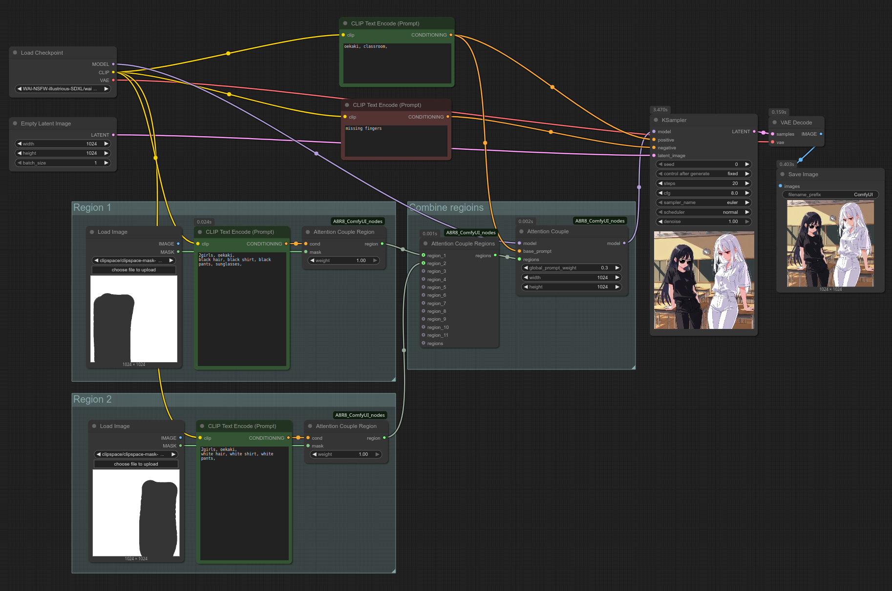

Воркфлоу можно открыть, перетащив скриншот выше в ComfyUI. (Если это не работает, сначала нужно сохранить его на ПК.) Изображения нужно загрузить самостоятельно ([1024x1024.png](./media/1024x1024.png)), затем щёлкнуть правой кнопкой мыши на них, выбрать "Open in MaskEditor" и нарисовать маски.

Важные моменты:

- Изображения регионов могут быть любыми при условии совпадения размеров с латентным изображением. Можно использовать даже референсные изображения с персонажами. При отсутствии готового изображения можно сделать нерегиональную генерацию и скопировать её в ноду "Load Image".
- Верхняя нода "CLIP Text Encode (Prompt)" описывает фон. Региональные промпты её не используют.
- Стандартные значения `weight` "Attention Couple Region" (1) и `global_prompt_weight` "Attention Couple" (0.3) менять не нужно.
- При промптинге для нескольких персонажей **необходимо использовать `2girls` в каждом регионе** (или `3girls`, `4girls`, `5girls`, `6+girls`. Обратите внимание, что тег — это `6+girls`, а не `6girls` или `7girls`). `1girl` используется только если происходит генерация лишних нежелательных персонажей.
- Значения `width` и `height` "Attention Couple" должны совпадать с латентным изображением.
- Если нужно добавить больше регионов, скопируйте одну из существующих групп с регионами и подключите её к ноде "Attention Couple Regions".

!!! danger "ОЧЕНЬ ЧАСТАЯ ОШИБКА"
	Эта ошибка встречается настолько часто, что стоит повторить: при промптинге для нескольких персонажей **необходимо использовать `2girls` в каждом регионе** (или `3girls`, `4girls`, `5girls`, `6+girls`. Обратите внимание, что тег — это `6+girls`, а не `6girls` или `7girls`). `1girl` используется только если происходит генерация лишних нежелательных персонажей.

#### Комбинация с ControlNet

Для объединения регионального промптинга с ControlNet нужно передать conditioning с позитивным промптом для фона и conditioning с негативным промптом в ноду "Apply ControlNet", а затем передать conditioning в "KSampler". При этом не имеет значения, получает ли вход `base_prompt` ноды "Attention Couple" позитивный conditioning до применения "Apply ControlNet" или после.

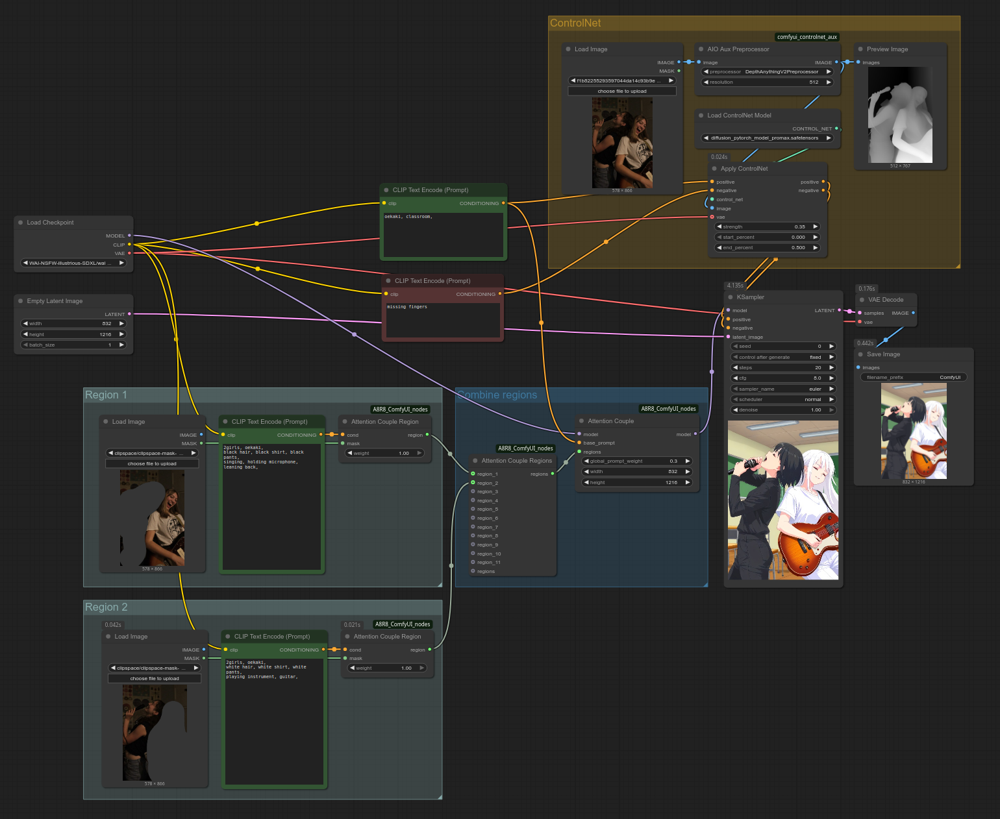

!!! info ""
	*Воркфлоу можно открыть, перетащив скриншот выше в ComfyUI. (Если не работает, сначала нужно сохранить его на ПК.)*

Как и раньше, входные значения для ControlNet/CoupleRegion и маски нужно настроить самостоятельно. [Исходное изображение](./media/regional_prompting_plus_controlnet_input.jpg). В большинстве случаев не следует задавать точные маски для персонажей на исходном изображении — лучше обозначить широкую область, которую должны занимать персонажи на результате. Слишком точная маска затруднит изменение художественного стиля или черт персонажей (например, длины волос).

---

### Быстрые советы по очистке спагетти

Этот раздел содержит краткий обзор методов упрощения воркфлоу на примере [воркфлоу регионального промптинга + ControlNet](#комбинация-с-controlnet).

!!! note "Полезные настройки"
	Несколько полезных настроек:

	- В настройках ComfyUI (кнопка Settings со значком шестерёнки) → раздел "Keybinding" можно назначить горячую клавишу для команды "Canvas Toggle Link Visibility" (например, CTRL + /), чтобы полностью скрывать связи между нодами в любой момент, когда не производится работа по изменению воркфлоу. Такой компромисс позволит пользоваться относительно чистым UI без необходимости проходить через сложности, которые описаны в этом разделе.
	- Можно изменить настройку "Link Render Mode" с стандартного "Spline" на "Straight" или "Linear", а также настройку "Link midpoint markers" с "Circle" на "Arrow".

!!! quote "Примечание переводчика"
    В актуальной версии ComfyUI скрытие связей между нодами также доступно через кнопку "Show/Hide Links" в навигационном виджете (правый нижний угол экрана).

Ноду можно переименовать, дважды щёлкнув на её имени. Исходное имя переименованной ноды можно увидеть, щёлкнув правой кнопкой мыши на ней и посмотрев на верхнюю строку меню.

Ноду можно свернуть, щёлкнув на кружке слева от её имени. Это полезно для нод, которые редко требуют изменений после настройки воркфлоу.

Беспроводные соединения можно создавать, используя ноды Get/Set из [ComfyUI-KJNodes](https://github.com/kijai/ComfyUI-KJNodes) и/или [cg-use-everywhere](https://github.com/chrisgoringe/cg-use-everywhere). В этом руководстве используется cg-use-everywhere. Подробности о его использовании см. в официальной документации.

!!! danger "Важно"
	[Убедитесь, что вы прочитали это предупреждение о кастомных нодах](#предупреждение-о-кастомных-нодах).

Рекомендуется использовать cg-use-everywhere только для значений, которые не меняются в воркфлоу, таких как CLIP и VAE. Также можно создать глобальные значения `width` и `height`, используя встроенную ноду "Int".

Беспроводные соединения для изменяющихся значений могут быть полезны в личных воркфлоу, но снижают читаемость для других. Используйте умеренно.

Применяя описанные выше советы, можно упростить воркфлоу следующим образом:

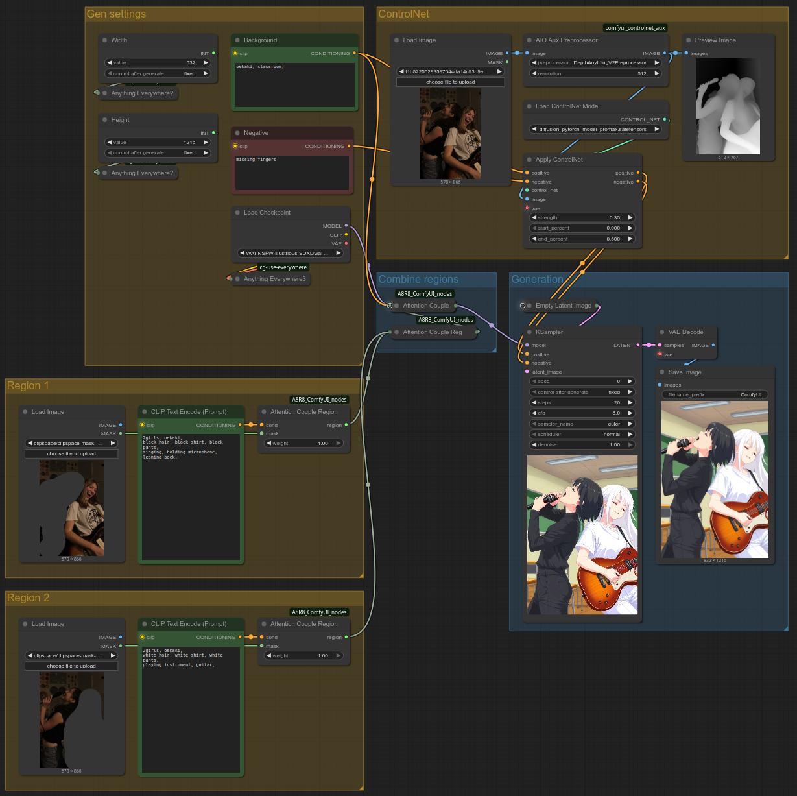

!!! note ""
	*Воркфлоу можно открыть, перетащив скриншот выше в ComfyUI. (Если не работает, сначала нужно сохранить его на ПК.)*

Входные значения для ControlNet/регионов и маски нужно задать самостоятельно. [Исходное изображение](./media/regional_prompting_plus_controlnet_input.jpg). Для работы воркфлоу требуется набор кастомных нод cg-use-everywhere.

#### Подграфы

!!! info "Обновление"
	Этот раздел ранее был о Group nodes, которые теперь устарели в пользу Подграфов. Оригинальный раздел о Group nodes доступен [здесь](#group-nodes).

Подграфы теперь доступны в последней версии ComfyUI. Хотя у них всё ещё есть некоторые шероховатости, они являются лучшей альтернативой Group nodes, которые ранее выполняли ту же задачу. Подграфы позволяют сгруппировать несколько нод в одну, а после создания подграфа можно скрыть настройки, которые не используются. Это очень полезно для очистки воркфлоу от беспорядка.

Чтобы создать Подграф, нужно выбрать ноды для объединения с помощью CTRL+перетаскивание, затем щёлкнуть правой кнопкой мыши на холсте ComfyUI и выбрать "Convert to Subgraph". Затем можно открыть Подграф и просмотреть содержащиеся в нём ноды, щёлкнув на значке справа от заголовка ноды Подграфа.

После создания Подграфа можно управлять видимостью входов, виджетов и выходов на основном холсте, открыв Подграф и создав связи между входами/виджетами/выходами, которые нужно пробросить, и специальными нодами входов и выходов у Подграфа.

Обратите внимание на следующие тонкости при использовании Подграфов с `cg-use-everywhere`:

- Чтобы передать беспроводное значение внутрь Подграфа, создайте вход Подграфа и выведите его на основной холст — тогда беспроводная нода подключится к нему снаружи
- Чтобы значение, производимое подграфом, стало беспроводно-доступным, нужно пробросить его как выход, затем подключить к ноде cg-use-everywhere на основном холсте, а не внутри Подграфа

На момент написания всё ещё много недоработок в функции Подграфов. Вот основные подводные камни, о которых стоит предупредить:

- Виджет предварительного просмотра изображений для ноды "Load Image" можно пробросить, но он, похоже, не поддерживает использование CTRL-V для загрузки изображений из буфера обмена. Поэтому пока лучше держать ноду "Load Image" вне подграфов при использовании этой функциональности.
- Переупорядочивание входов/выходов Подграфа требует удаления входов/выходов и их повторного создания. Надеюсь, что скоро это будет улучшено.
- Виджет "control after generate" для seed можно пробросить, но он не будет работать — seed всегда будет фиксированным. Обходной путь: используйте ноду "Int" снаружи Подграфа и подключите к входу "seed" у вашего Подграфа.

Вот как выглядит воркфлоу с использованием Подграфов:

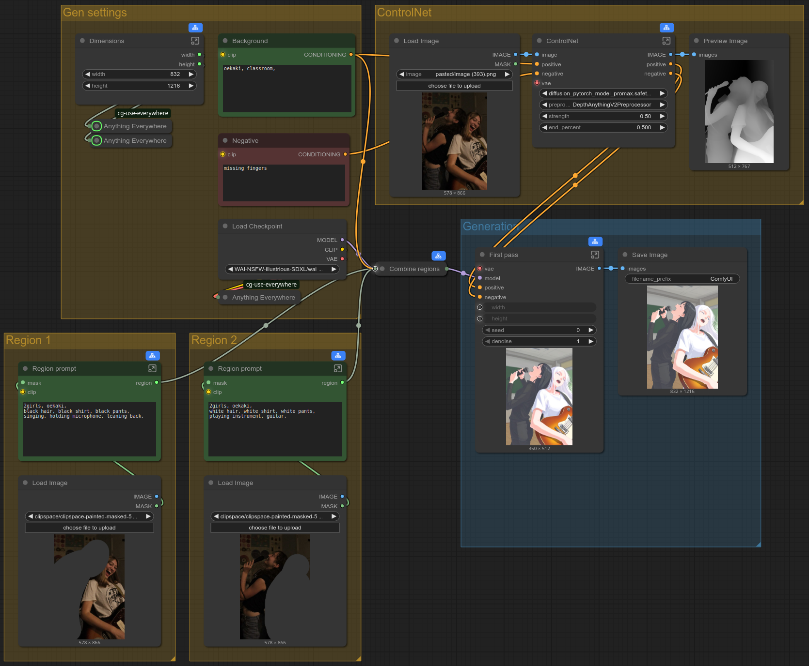

!!! note ""
	*Воркфлоу можно открыть, перетащив скриншот выше в ComfyUI. (Если не работает, сначала нужно сохранить его на ПК.)*

#### Group nodes

!!! warning "Функционал устарел"
	Group nodes устарели в пользу [Подграфов](#подграфы), но данный раздел не был удалён, так как всё ещё может быть полезным.

Название Group nodes может вводить в заблуждение, так как они отличаются от обычных групп (Groups). У Group nodes есть проблемы с UX, но, к счастью, они скоро будут заменены Подграфами ([в настоящее время находятся в открытом тестировании](https://blog.comfy.org/p/subgraph-update-easier-testing)). Group nodes будут автоматически конвертированы в подграфы при выходе подграфов, поэтому не стоит беспокоиться о напрасных усилиях.

Group nodes позволяют сгруппировать несколько нод в одну, а после создания Group node можно скрыть настройки, которые не используются. Это очень полезно для очистки воркфлоу от беспорядка.

Чтобы создать Group node, нужно выбрать ноды для объединения с помощью CTRL+перетаскивание, затем щёлкнуть правой кнопкой мыши на холсте ComfyUI и выбрать "Convert to Group Node". (Group node можно конвертировать обратно в отдельные ноды, щёлкнув на ней правой кнопкой мыши и выбрав "Convert to nodes".)

Обратите внимание, что нельзя включить ноду cg-use-everywhere внутрь Group node (она не будет работать), а [ноды Get/Set от Kijai также имеют плохую совместимость с Group nodes](https://github.com/kijai/ComfyUI-KJNodes/issues/156).

После создания Group node можно скрыть входы/виджеты/выходы, которые не нужны, щёлкнув на ней правой кнопкой мыши и выбрав "Manage Group Node". Обратите внимание, что работать с этим меню иногда неудобно, например, приходится заново скрывать всё, если разбить группу нод и сгруппировать их снова.

Стоит также отметить следующие недоработки:

- Наборы кастомных нод, используемые ТОЛЬКО внутри Group nodes (и нигде вне их), не будут обнаружены детектором отсутствующих кастомных нод в ComfyUI-Manager. Если нужно, чтобы другие могли обнаружить отсутствующие ноды, придётся разместить кастомные ноды где-то вне Group nodes. (Их не нужно ни к чему подключать.)
- При загрузке воркфлоу с отсутствующими нодами внутри Group nodes, эти Group nodes будут повреждены. После установки недостающих нод потребуется удалить воркфлоу и импортировать его заново.

Остаётся надеяться, что подграфы скоро выйдут и избавят нас от всех этих недоработок.

Вот как выглядит воркфлоу с использованием Group nodes:

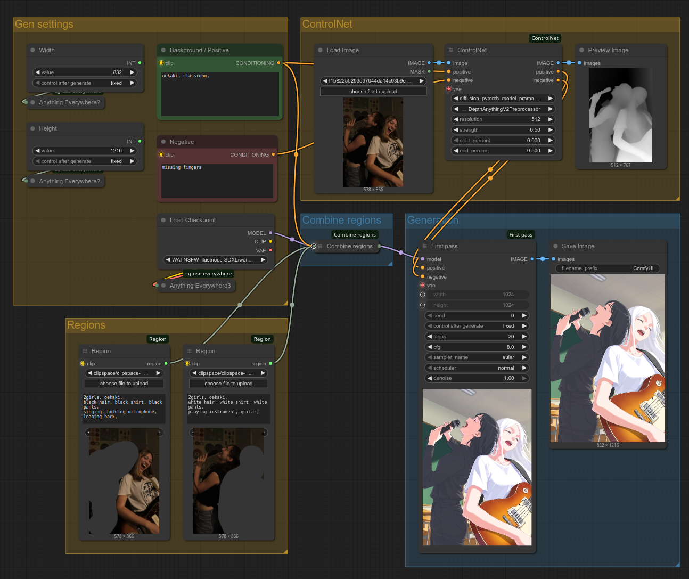

!!! note ""
	*Воркфлоу можно также открыть, перетащив скриншот выше в ComfyUI. (Если не работает, сначала нужно сохранить его на ПК.)*