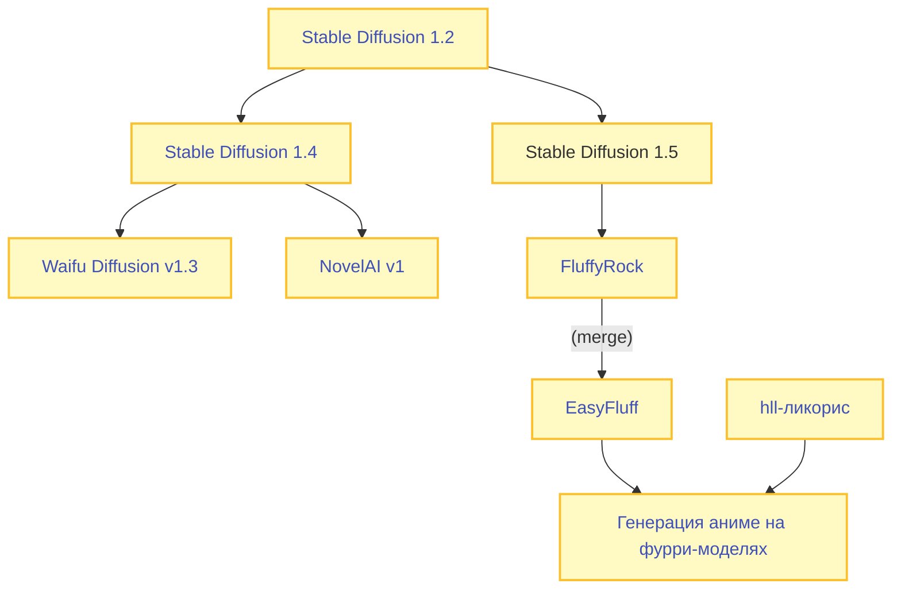
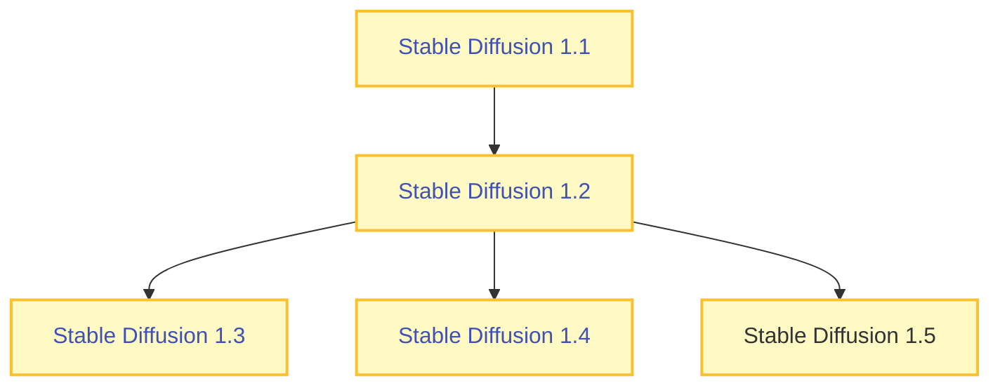

# Stable Diffusion 1

В этой статье рассматриваются файнтьюны на основе Stable Diffusion 1, подходящие для генерации аниме.

Схема наследования крупных файнтьюнов для Stable Diffusion 1:

## FAQ
**Какой чекпоинт выбрать?**  
Stable Diffusion v1 и его производные являются устаревшими моделями на момент 2025 года.

Вместо них, рекомендуется обратить внимание на чекпоинты из семейства [Stable Diffusion XL](./stable-diffusion-xl.md). В отдельных случаях вам так же может быть интересен [FLUX](./flux.md).  

Использовать чекпонты на основе Stable Diffusion v1 в 2025 году может иметь смысл по следующим причинам:

- У вас слабое железо для запуска чекпоинтов на базе Stable Diffusion XL  
- Либо чтобы использовать инструменты, доступные только для Stable Diffusion v1 (например [Controlnet QR Code Monster v2 For SD-1.5
](https://huggingface.co/monster-labs/control_v1p_sd15_qrcode_monster))  

---

**Какой чекпоинт из семейства Stable Diffusion v1 выбрать?**  
EasyFluff + HLL-ликорис

## Stable Diffusion v1

[Stable Diffusion v1.4](https://huggingface.co/CompVis/stable-diffusion-v1-4) - это модель, выпущенная Stability AI в августе 2022 года. Это первая из открытых моделей для генерации изображений, ставшая массовой.

Выпуску Stable Diffusion v1.4 предшествовали модели 1.1, 1.2 и 1.3. Схему наследования можно увидеть ниже:

| Версия модели | Число шагов  | Размер изображений | Датасет          |
|---------------|--------------|--------------------|------------------------------------------------------|
| v1.1          | 237k + 194k  | 256x256 + 512x512  | [LAION-2B-en](https://huggingface.co/datasets/laion/laion2B-en) и [laion-high-resolution](https://huggingface.co/datasets/laion/laion-high-resolution) |
| v1.2          | 515k         | 512x512            | [LAION-2B-en](https://huggingface.co/datasets/laion/laion2B-en) с фильтрацией по эстетике    |
| v1.3          | 195k         | 512x512            | [LAION-2B-en](https://huggingface.co/datasets/laion/laion2B-en) с фильтрацией по эстетике, в 10% обучалось без текста       |
| v1.4          | 225k         | 512x512            | [LAION-2B-en](https://huggingface.co/datasets/laion/laion2B-en) с улучшенной фильтацией по эстетике, в 10% обучалось без текста         |
| v1.5          | 595k         | 512x512            | [LAION-2B-en](https://huggingface.co/datasets/laion/laion2B-en) с улучшенной фильтацией по эстетике, в 10% обучалось без текста         |

Для обучения каждой модели использовалось `256 x A100 GPUs` с итоговым batch size `2 x 8 x 2 x 4 = 2048`.

Суммарно на семейство моделей Stable Diffusion v1 было потрачено 150,000 GPU-часов.

Оригинальные модели из семейства Stable Diffusion v1 слабо подходят для генерации аниме. Однако, эти модели послужили хорошей базой для дальнейших файнтьюнов, о которых и пойдёт речь ниже.

??? info "Скандал с CSAM в датасете LAION-5B и последующее удаление Stable Diffusion v1.5 из публичного доступа"
    В августе 2024, Stable Diffusion v1.5 был [удалён со всех официальных источников](https://www.reddit.com/r/StableDiffusion/comments/1f5mvsg/stable_diffusion_15_model_disappeared_from/). Представители StabilityAI не давали официальных комментариев по произошедшему.
    
    Этому событию предшествовали расследования нескольких институтов и "независимых исследователей", которые [нашли](https://stacks.stanford.edu/file/kh752sm9123/ml_training_data_csam_report-2023-12-23.pdf) в LAION-5B (надмножество LAION-2B) около 140-2000 (в зависимости от эксперта) изображений, классифицированных как детская порнография; вследствии чего эти датасеты были удалены с Hugging Face.
    
    Неудовлетворившись результатом, эксперты "по безопасному и этичному AI" требовали удалить из публичного доступа все модели, обученные с использованием данных датасетов (речь, в первую очередь, про Stable Diffusion v1), а так же любые производные от них модели.
    
    Так же, данными исследователями ранее [критиковалась сама идея открытых релизов моделей](https://stacks.stanford.edu/file/jv206yg3793/20230624-sio-cg-csam-report.pdf), поскольку существуют механизмы дообучения моделей и LoRA, что позволит генерировать CSAM, даже если исходные датасеты были безопасны.

    Многие связывают эти два события, а отсутствие комментариев StabilityAI только усиливает подозрения. Сама [новость была воспринята с экстазом](https://www.linkedin.com/posts/davidevanharris_ai-csam-childsafety-activity-7235030045528891392-FwWE) различными экспертами по безопасному AI, и они пообещали и дальше работать над усилением контроля открытых моделей и датасетов.

## Waifu Diffusion v1.3

[Waifu Diffusion v1.3](https://huggingface.co/hakurei/waifu-diffusion-v1-3) - это первый получивший известность крупный аниме-файнтьюн, выполненный энтузиастами.

Данная модель была обучена в октябре 2022. Датасет состоял из 680k аниме-картинок. 

Релиз Waifu Diffusion v1.3 совпал со сливом NovelAI v1. В результате, Waifu Diffusion v1.3 не получил какой-либо популярности, так как заметно проигрывал своему конкуренту в качестве.

## NovelAI v1

- [Официальный релиз лета 2024](https://huggingface.co/NovelAI/nai-anime-v1-full)
- [Слив октября 2022 (торрент)](magnet:?xt=urn:btih:5bde442da86265b670a3e5ea3163afad2c6f8ecc&dn=novelaileak)
- [Лоры и дополнительная информация с форча](https://gitgud.io/badhands/makesomefuckingporn)  
- [Старый каталог популярных моделей на основе NovelAI v1](https://civitai.com/collections/42742)

[NovelAI](https://novelai.net/) - это подписочный онлайн-сервис, который который позволяет генерировать истории и изображения при помощи набора разработанных командой данного сервиса нейросетей.

В октябре 2022 года, когда NovelAI только запустили сервис для генерации изображений в стиле аниме, веса их модели практически сразу же ~~были опубликованы~~ утекли в публичный доступ, благодаря чему кто-угодно мог начать генерировать изображения локально, без какой-либо платы.

С момента слива было выпущено огромное количество основанных на NAI мёрджей и файнтьюнов, большая часть из них может быть найдена на цивите.

Подавляющее большинство SD1 чекпоинтов для генерации аниме в той или иной степени основано на утечке NAI.

---

Летом 2024 года (почти спустя два года после утечки) NovelAI выпустили свою модель в публичный доступ [официально](https://x.com/novelaiofficial/status/1826696239154692491), так что никому больше не нужно переживать за правовой статус использования данного чекпоинта.

## EasyFluff + HLL
- [Подробная информация на английском](https://rentry.org/5exa3)

!!! quote "История о том, как меня перестали пугать фурри-модели и я начал генерировать на них аниме"

[EasyFluff](https://civitai.com/models/129996/easyfluff) представляет собой мёрдж на основе [FluffyRock](https://civitai.com/models/92450?modelVersionId=124661), который является файнтьюном Stable Diffusion 1.5.

Специализацией EasyFluff и FluffyRock является генерация фуррей.

В ноябре 2023 аноном в форча был обучен [крупный ликорис](https://huggingface.co/CluelessC/hll-test/tree/main/lyco) (800Мб при весе модели в 2Гб), благодаря которому стало возможным генерировать обычных аниме-тяночек на данном чекпоинте.

Связка EasyFluff с подключённым HLL-ликорисом была наилучшим решением для генерации NSFW до момента выхода Pony Diffusion V6 XL в январе 2024.

Данный подход может быть интересен тем, чьё железо не позволяет комфортно запускать SDXL-чекпонты

**Особенности связки EasyFluff + HLL**  

- Высокое базовое разрешения (вплоть до 1088 пикселей) без потери когерентности
- Наилучшее понимание NSFW-концептов среди всех SD1 чекпоинтов
- Знание огромного количества [аниме-художников](https://files.catbox.moe/c1jlaq.txt) из коробки
- Понимание тегов в стиле danbooru и e621
- Совместимость с лорами для NAIv1

**Как установить**  

1. Скачать [EasyFluff](https://huggingface.co/zatochu/EasyFluff/resolve/main/EasyFluffV11.2.safetensors)
2. Скачать [yaml-конфиг](https://huggingface.co/zatochu/EasyFluff/raw/main/EasyFluffV11.2.yaml) и разместить его в директории с моделью
3. Скачать [hll-ликорис](https://huggingface.co/CluelessC/hll-test/blob/main/lyco/hll6.3-fluff-a9.safetensors) и использовать его в паре с моделью

[Картинка с PNG-Info](https://files.catbox.moe/t11uwi.png) для примера.

---

**Готовые мёрджи**  

Очевидная идея — почему-бы просто не смёрджить EasyFluff + HLL и использовать данный мёрдж как самостоятельный чекпоинт?

Именно такой подход реализован в семействе **Based** моделей, начиная с 68 версии:

**Based**  

- [Based 69](https://civitai.com/models/299275/based69)  
- [Based 68](https://civitai.com/models/236447/based68)

**LS_Kerberos**  

- [Huggingface](https://huggingface.co/latent-space-dreams/LS_Kerberos/blob/main/LS_Kerberos_v1_1.safetensors)  
  (используется тот же рецепт, что в Based, но дополнительно добавлен [LS Vividus](https://civitai.com/models/85283/ls-vividus))

## Дополнительные ссылки

**Общее**  

- [Аниме-чекпоинты на цивите](https://civitai.com/search/models?baseModel=SD%201.5&baseModel=SD%201.4&modelType=Checkpoint&tags=anime&sortBy=models_v9)  
  (по ошибке большинство NAI1-чекпоинтов отнесены к SD1.5, а не SD1.4)  
- [Аниме-лоры на civitai](https://civitai.com/search/models?baseModel=SD%201.5&baseModel=SD%201.4&modelType=LORA&tags=anime&sortBy=models_v9)  

**ControlNet-модели**  

- [ControlNet 1.1](https://civitai.com/models/38784)  
- [QR Code Monster](https://huggingface.co/monster-labs/control_v1p_sd15_qrcode_monster)  
