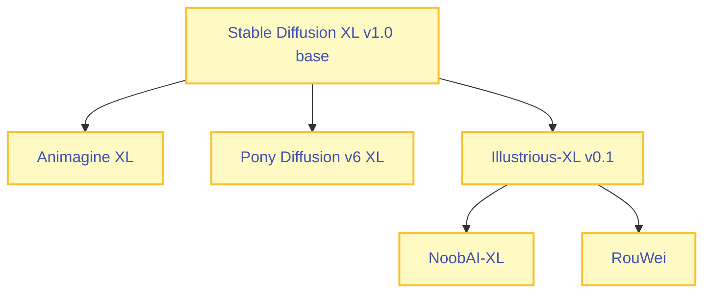
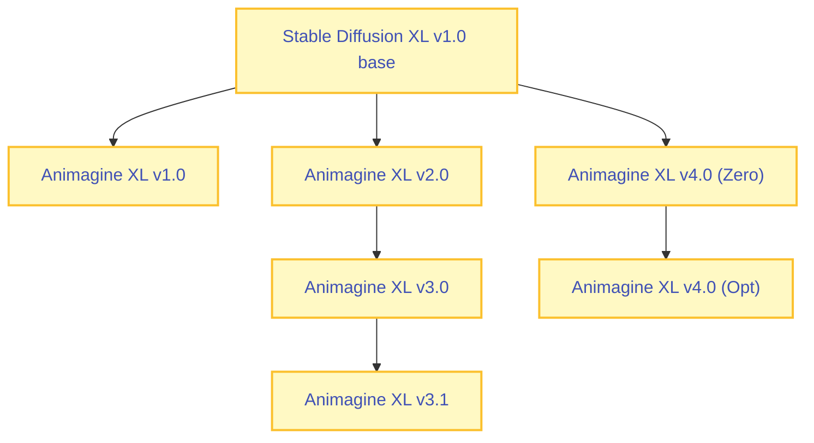
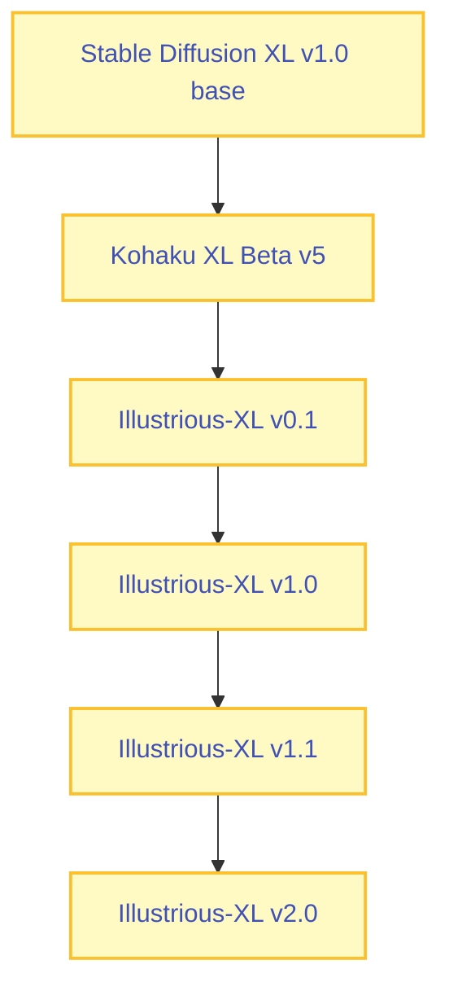
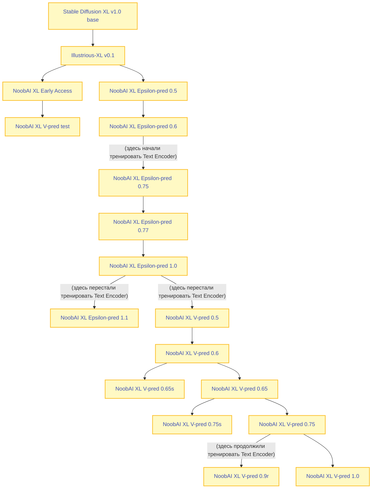
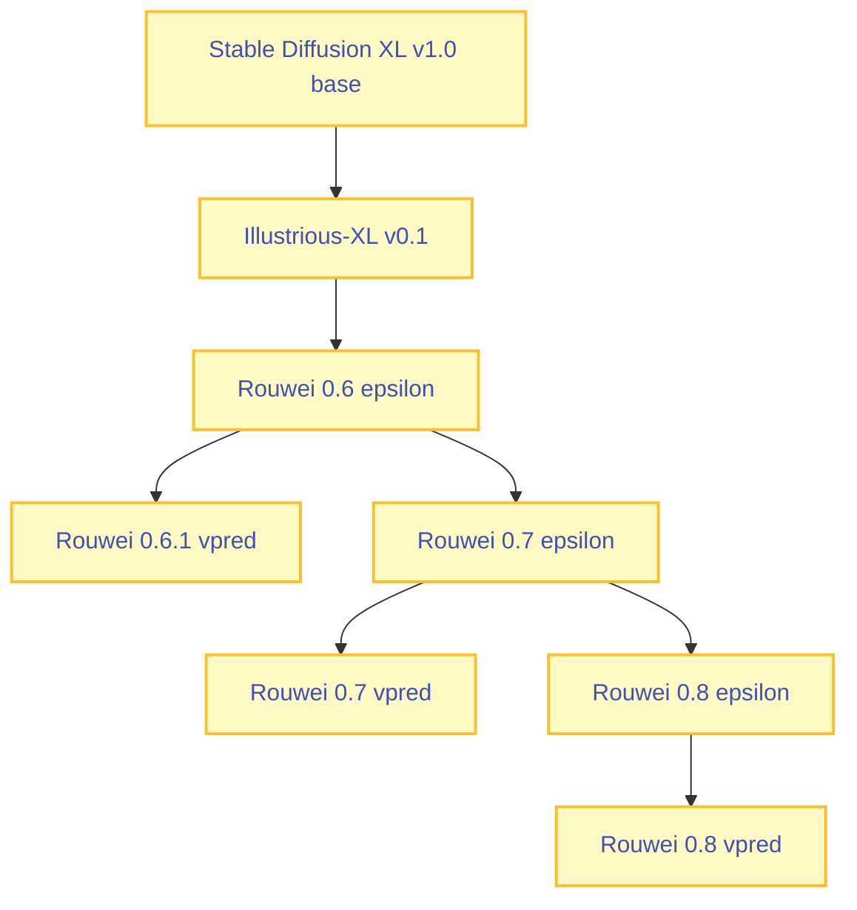

# Stable Diffusion XL

В этой статье рассматриваются файнтьюны на основе Stable Diffusion XL, подходящие для генерации аниме.

Схема наследования крупных файнтьюнов для Stable Diffusion XL:



## FAQ
**Какой чекпоинт выбрать?**  

На момент июня 2025, все актуальные SDXL-чекпоинты являются производными от Illustrious-XL v0.1. Данный чекпоинт, как правило, не используют напрямую, а вместо этого используют один из файнтьюнов/мёрджей на его основе.

В качестве рекомендации советую обратить внимание на эти чекпоинты:

- [WAI-NSFW-illustrious-SDXL](https://civitai.com/models/827184/wai-nsfw-illustrious-sdxl) - популярный мёрдж на базе Illustrious-XL v0.1. Обладает приятной "из коробки" стилистикой, менее требователен к структуре промпта, хорошо подойдёт новичкам или для быстрых результатов без сложной настройки.
- [NoobAI-XL](https://civitai.com/models/833294/noobai-xl-nai-xl) - один из самых масштабных open-source файнтьюнов Illustrious-XL. Подходит для стилистически сложных и вариативных генераций в аниме/фурри-направлениях. Требует больше внимания к промпту.
- [RouWei](https://civitai.com/models/950531) - продвинутый файнтьюн Illustrious-XL v0.1, с упором на работу со сложными промптами: теги + вспомогательный натуртекст. Минимизирует протечки тегов и даёт более управляемый результат. Подходит тем, кто готов уделить внимание правильной структуре промпта.

## Stable Diffusion XL

[Stable Diffusion XL](https://huggingface.co/stabilityai/stable-diffusion-xl-base-1.0) - серия базовых моделей от Stability AI, выпущенная в июне-июле 2023 года.

Для XL было выпущенно сразу две модели на идентичной архитектуре, которые предполагалось использовать одновременно:

* [SD-XL 1.0-base](https://huggingface.co/stabilityai/stable-diffusion-xl-base-1.0) - основная модель  
* [SD-XL 1.0-refiner](https://huggingface.co/stabilityai/stable-diffusion-xl-refiner-1.0) - дополнительная модель, которая должна была использоваться в паре с base

**Base** и **Refiner** обучались на разных данных и обладают разной функциональной ролью.

Идея использования Refiner в Stable Diffusion XL - это разделение генерации изображения на два этапа, чтобы достичь лучшего качества деталей:


1. Сперва **Base** генерирует грубое изображение, включая форму, композицию и цвета. Но без мелких деталей.
2. Далее **Refiner** принимает [латентное пространство](../vae.md) от Base и проводит дополнительную обработку, улучшая детали изображения.

!!! info "Забвение идеи Refiner'а"
    Подход с использованием Refiner не стал стандартом: на практике, все производные от SDXL-модели основаны только на base-модели и применяются без дополнительной обработки.

## Animagine
* [Блог команды (Cagliostro Research Lab)](https://cagliostrolab.net/)
* [Анонс Animagine XL 3.0](https://cagliostrolab.net/posts/animagine-xl-v3-release)
* [Анонс Animagine XL 4.0](https://cagliostrolab.net/posts/animagine-xl-v4-release)



[Animagine XL V3.0](https://civitai.com/models/260267?modelVersionId=293564) - первый относительно-популярный аниме-файнтьюн на базе Stable Diffusion XL, выпущенный в январе 2024. Для обучения использовалось 2x A100 80GB, всего затрачено 500 GPU-часов.

[Animagine XL V3.1](https://civitai.com/models/260267?modelVersionId=403131) - файнтьюн на основе Animagine XL V3.0, выпущенный в марте 2024. В качестве железа использовались 2x A100 80GB, было дополнительно затрачено 350 GPU-часов. Датасет состоял из 870k изображений.

Animagine XL V3.0 и Animagine XL V3.1 вышли практически одновременно с **Pony Diffusion V6 XL**. Анимейджин сильно уступал в качестве поням, поэтому не получил широкого распространения.  

---

[Animagine XL V4.0 (Anim4gine)](https://civitai.com/models/1188071/animagine-xl-40) - попытка той же команды сделать более крупный тьюн уже спустя год (февраль 2025). Датасет был значительно расширен - для этой версии использовано 8.4M изображений и всего было затрачено 2650 GPU-часов.

У данного чекпоинта есть несколько вариаций:

- [Zero](https://civitai.com/models/1188071?modelVersionId=1409042) - чистый тьюн с SDXL. Разработчик анимейджина предлагает использовать данный чекпоинт для создания производных моделей и обучения LoRA  
- [Opt (optimized)](https://civitai.com/models/1188071?modelVersionId=1408658) - "отшлифованная" версия Zero-чекпоинта. По словам разработчика, обладает меньшим числом проблем с цветами/анатомией и т.п; ориентирована уже на саму генерацию  

Релиз четвёртого анимейджина произошёл уже после появления **Illustrious-XL v0.1** и популярных тьюнов/мёрджей на его основе. Анимейджин v4.0 не предоставлял ничего нового относильно люстры и уступал ей в качестве, поэтому данный чекпоинт так же не получил широкого распространения.

## Pony Diffusion V6 XL

- [Лоры и дополнительная информация с форча](https://rentry.org/ponyxl_loras_n_stuff)
- [Лоры на civitai для Pony Diffusion V6 XL](https://civitai.com/search/models?baseModel=Pony&modelType=LORA&sortBy=models_v9)
- [Модели на основе Pony Diffusion V6 XL](https://civitai.com/search/models?baseModel=Pony&modelType=Checkpoint&tags=anime&sortBy=models_v9)

[Pony Diffusion V6 XL](https://civitai.com/models/257749/pony-diffusion-v6-xl) (так же известный как Pony Diffusion или PonyXL) - самый популярным файнтьюн SDXL первой половины 2024 года.

Данный чекпоинт был выпущен в январе 2024 года. Для обучения было использовано ~2.6M картинок - в равных пропорциях в датасете присутствовали аниме/западная анимация/фурри/пони.

Модель получила большую популярность в связи с тем, что это был первый SDXL-чекпоинт, который умел генерировать сложные позы и NSFW концепты с малым числом проблем в анатомии (в сравнении с прочими чекпоинтами).

Модель была обучена энтузиастом с никнеймом **Astralite**, известным своей любовью к франшизе My Little Pony.

### Теги качества

Pony Diffusion V6 XL использует свою систему тегов качества, которая не похожа на используемые в других чекпоинтах.

В **positive prompt** нужно добавлять:
```
score_9, score_8_up, score_7_up, score_6_up, score_5_up, score_4_up, source_anime
```

В **negative prompt** стоит добавлять:
```
source_pony, source_furry, source_cartoon
```

??? abstract "Объяснение score_9 и прочего"
    Наиболее подробное описание принципа работы скоров дал сам автор поней в [своей статье на цивите](https://civitai.com/articles/4248). Ниже изложена информация о том, откуда вообще появились все эти `score_9` и прочее.

    Перед обучением PonyXL, сперва был обучен aesthetic-классификатор, задачей которого было определить "качество" изображения в формате плавающей цифры от нуля до единицы.

    С помощью этого классифкатора, было оценено каждое изображение в датасете Pony Diffusion. В зависимости от оценки классификатора, для каждого изображений, в добавок к основному запросу, была добавлена строка с описанием тегов качества в следующем формате:  

    - **Качество 90%-100%**: score_9, score_8_up, score_7_up, score_6_up, score_5_up, score_4_up  
    - **Качество 80%-90%**: score_8, score_7_up, score_6_up, score_5_up, score_4_up  
    - **Качество 70%-80%**: score_7, score_6_up, score_5_up, score_4_up  
        
    И так далее.  
        
    Теоретическая задумка была в том, чтобы, указывая тег ```score_9```, мы бы "просили" модель ориентироваться, в первую очередь, на картинки, которые получили aestetic-оценку 90% и выше, что, по задумке автора, должно было снижать вариативность, но улучшать качество изображений.
        
    Однако, сам автор поней считает, что он облажался, и, по факту, модель выучила, что вся строка целиком описывает хорошее качество, а не её отдельные части:  

    > In reality I exposed myself to a variation of The Clever Hans effect where the model learned that the whole long string correlates to the "good looking" images, instead of separate parts of it. I will fix this in V7.  
        
    Как итог - общей рекомендацией по промптам для чекпоинтов на основе Pony Diffusion является использование подробной строки, описывающей максимальное качество, а именно:

    ```
    score_9, score_8_up, score_7_up, score_6_up, score_5_up, score_4_up
    ```
### Модели на основе поней

| Модель | Примечания |
| ------ | ---------- |
| [Pony Diffusion V6 XL](https://civitai.com/models/257749/pony-diffusion-v6-xl) | Неповторимый оригинал от самого преданного фаната франшизы "Мой маленький пони". Ponygods, I kneel! |
| [AutismMix SDXL](https://civitai.com/models/288584/autismmix-sdxl) | Один из самых популярных мёрджей на основе PonyDiffusion V6 XL. Данная модель предоставляет хороший базовый стиль и анатомию, но ценой является снижение вариативности генераций. |
| [4th tail](https://civitai.com/models/282341) | Продвинутый файнтьюн поней со знанием большого количества [художников](https://files.catbox.moe/zeac9p.txt) ([примеры в картинках](https://mega.nz/folder/Yb5yyTDR#ZDuklCQXfw-Rd-dsJtcoOQ)) и [персонажей](https://files.catbox.moe/vqv8iv.txt) из коробки. |
| [T-ponynai3](https://civitai.com/models/317902/t-ponynai3) | Ещё один популярный аниме-файнтьюн поней. |
| [Все модели на основе поней](https://civitai.com/search/models?baseModel=Pony&modelType=Checkpoint&tags=anime&sortBy=models_v9) | На случай, если этого списка вам показалось мало, то по этой ссылке вы сможете найти все чекпоинты на основе поней, тысячи их! |

## Illustrious-XL

- [Лоры с форча для Illustrious-XL](https://rentry.org/illustrious_loras_n_stuff)
- [Лоры на civitai для Illustrious-XL](https://civitai.com/search/models?baseModel=Illustrious&modelType=LORA&tags=anime&sortBy=models_v9)
- [Модели на основе Illustrious-XL](https://civitai.com/search/models?baseModel=Illustrious&modelType=Checkpoint&tags=anime&sortBy=models_v9)
- [Сайт компании-разработчика (Onoma AI)](https://onomaai.com/)
- [Технический блог Illustrious-XL](https://www.illustrious-xl.ai/blog)
- [Описание Illustrious-XL v0.1 от разработчика](https://huggingface.co/OnomaAIResearch/Illustrious-xl-early-release-v0)



[Illustrious-XL v0.1](https://civitai.com/models/795765/illustrious-xl) - крупный файнтьюн на базе [Kohaku-XL beta v5](https://civitai.com/models/162577?modelVersionId=183131), разработанный коммерческой компанией [Onoma AI](https://onomaai.com/). Данный чекпоинт попал в публичный доступ в сентябре 2024.

Это первый из открытых XL-чекпоинтов, который знает множество аниме-художников и персонажей. Благодаря этому, во многих случаях стало возможно использовать нужные стили/персонажей без подключения [LoRA-моделей](../lora/index.md).

Модель обучена на 5+ миллионах изображений с Danbooru, датасет опубликован [в публичном доступе](https://huggingface.co/datasets/nyanko7/danbooru2023).

Illustrious-XL v0.1 быстро приобрела популярность после выхода и являлась базой для прочих популярных чекпоинтов, таких как [WAI-NSFW-illustrious-SDXL](https://civitai.com/models/827184/wai-nsfw-illustrious-sdxl) и [NoobAI-XL](https://civitai.com/models/833294/noobai-xl-nai-xl). 

!!! info "Версии моделей"
    Чекпоинты **Illustrious-XL v1.0**, **v1.1** и **v2.0** не смогли повторить успех версии **v0.1**. Они получили гораздо меньшее распространение и не стали популярными в сообществе.

### Бизнес-модель Onoma AI

Разработчик модели, компания Onoma AI, применяет гибридную бизнес-модель:  

**1. Публичный доступ** предоставляется только к устаревшим версиям моделей.  

**2. Актуальные чекпоинты** доступны только по подписке через их онлайн-платформу.  

Таким образом, компания монетизирует свои самые передовые разработки, ограничивая их доступ для широкой аудитории.

Эта стратегия позволяет им одновременно поддерживать интерес комьюнити и зарабатывать на подписках.

### Драма с несостоявшимся релизом Illustrious-XL v3.5

В марте 2025 года Onoma AI запустили на своём официальном сайте систему донатов. Пользователям предлагалось скидываться на релиз понравившейся закрытой модели в публичный доступ. Каждая модель имела фиксированную стоимость в эквиваленте $3000 (по курсу: 100 stardust = $1).

**Развитие событий**

Сообщество, естественно, решило донатить на самую последнюю и ожидаемую версию - Illustrious-XL v3.5 vpred, игнорируя более старые. Однако, когда сумма была собрана, Onoma AI внезапно выложили в публичный доступ не 3.5, а старую версию 2.0.

**Реакция комьюнити**

Такой поворот вызвал бурю негодования. Пользователи почувствовали себя обманутыми: ожидался релиз 3.5, а вместо этого компания выпустила неактуальный чекпоинт и объявила, что теперь для публикации Illustrious-XL v3.5 необходимо собрать уже $530,000.

**Возможные причины**  

По некоторым данным, изначально на сайте была информация, что релиз идёт поэтапно - от старых версий к новым. Но эта информация была подана в виде сноски мелким шрифтом.

Это породило ложные ожидания в сообществе.  

**Итог**  

Компания Onoma AI оказалась в центре критики из-за непрозрачной системы донатов. Несмотря на популярность Illustrious-XL, доверие к разработчику было серьёзно подорвано.

??? info "Драма в картинках"
    === "Ожидание"
        
        

    === "Реальность"
        
        
        
        
        

## NoobAI-XL

- [Huggungface команды Laxhar Dream Lab](https://huggingface.co/Laxhar)  
- [Лоры на civitai для NoobAI-XL](https://civitai.com/search/models?baseModel=NoobAI&modelType=LORA&tags=anime&sortBy=models_v9)
- [Модели на основе NoobAI-XL](https://civitai.com/search/models?baseModel=NoobAI&modelType=Checkpoint&tags=anime&sortBy=models_v9)



[NoobAI-XL](https://civitai.com/models/833294) — серия файнтьюнов Illustrious-XL от команды **Laxhar Dream Lab**, состоящей из энтузиастов и независимых исследователей. Было выпущено несколько версий в октябре-декабре 2024 года. Считается самым дорогим некоммерческим файнтьюном SDXL.

Модель обладает богатыми знаниями стилей и персонажей, так что вам, во многих случаях, будут не нужны дополнительные [LoRA-модели](../lora/index.md).

Составляющие части датасета (всего 12.7 миллионов изображений):

- Полный дамп [Danbooru](https://danbooru.donmai.us/) октября 2024
- [Датасет](https://huggingface.co/datasets/NebulaeWis/e621-2024-webp-4Mpixel) картинок с [e621](http://e621.net/)

Для первых чекпоинтов в качестве GPU использовались 8 x NVIDIA H100. В более поздних (1.0 epsilon и дальше) использовались уже 32 x NVIDIA H100 GPU.

!!! info "Про тренировку Text Encoder"
    Многие считают, что разблокировка тренировки Text Encoder пошла во вред модели (из за "отравления" датасета фурри-тегами).

!!! info "Версии моделей"
    Чисто технически, ближе к V-pred 1.0 модель должна быть натренирована лучше всего, но многие в это не верят и предпочитают сидеть на более старых версиях.

## RouWei



[RouWei](https://civitai.com/models/950531/RouWei) - серия fine-tune-чекпоинтов, основанная на [Illustrious-XL v0.1](https://civitai.com/models/795765/illustrious-xl), разработанная энтузиастом-одиночкой с никнеймом **Minthybasis**.

Модель унаследовала сильные стороны своего предка - она распознаёт теги художников и персонажей с Danbooru, что позволяет запрашивать конкретные стили и персонажей напрямую через промпт.

Первый чекпоинт Rouwei был выпущен в ноябре 2024 года, а серия продолжала активно обновляться до июня 2025 года.

Для обучения Rouwei было затрачено более 8000 GPU-часов на кластере с H100, не считая времени, ушедшего на исследования и неудачные эксперименты.

Rouwei осуществляет глубокую переработку Illustrious v0.1, направленнуя на:

- расширение знаний о персонажах, стилях и концептах
- работу со сложными промптами: теги + опциональный вспомогательный натуртекст
- решение проблем с протеканием тегов (tag bleeding) и систематическими искажениями (bias)

Подход подготовки датасета сильно отличался от NoobAI. Некоторые особенности перечислены ниже:

| <div style="width:150px"></div>   | <div style="width:250px">NoobAI</div> | RouWei v0.8 epsilon
| :---------------------------------| :----------------------------         | :-----------------------------------
| **Размер датасета**               | 12.7M                                 | ~13M
| **Источники данных**              | Danbooru (8.7M) + e621 (4M)           | Анимешные booru + узкая выборка с e621 + приватные галереи (в т.ч. от самих художников)
| **Фурри-контент**                 | 4M изображений с e621                 | Небольшое количество изображений, включённых для проработки редких концептов
| **Тип промпта**                   | Danbooru-теги + e621                  | Booru-теги + 4M изображений с натуртекстом (выполнено через Claude, GPT, Gemini и [ToriiGate](https://huggingface.co/Minthy/ToriiGate-v0.4-7B)), что расширяет возможности промптинга
